# Heimdall MCP Server - Your AI Coding Assistant's Long-Term Memory

[](https://www.python.org/downloads/)
[](hhttps://github.com/lcbcFoo/heimdall-mcp-server/blob/main/README.mdttps://opensource.org/licenses/Apache-2.0)
[](https://www.docker.com/)
[](https://modelcontextprotocol.io/)
[](https://youtu.be/7X1gntAXsao)

**The Problem:** Your AI coding assistant has short-lived memory. Every chat session starts from a blank slate.

**The Solution:** Heimdall gives your LLM a persistent, growing, cognitive memory of your specific codebase, lessons and memories carry over time.


https://github.com/user-attachments/assets/120b3d32-72d1-4d42-b3ab-285e8a711981


## Key Features

- 🧠 **Context-Rich Memory**: Heimdall learns from your documentation, session insights, and development history, allowing your LLM to recall specific solutions and architectural patterns across conversations.
- 📚 **Git-Aware Context**: It indexes your project's entire git history, understanding not just what changed, but also who changed it, when, and context.
- 🔗 **Isolated & Organized**: Each project gets its own isolated memory space, ensuring that context from one project doesn't leak into another.
- ⚡ **Efficient Integration**: Built on the Model Context Protocol (MCP), it provides a standardized, low-overhead way for LLMs to access this powerful memory.

## 🚀 Getting Started

**Prerequisites**: Docker and Docker Compose must be installed and running.

Heimdall is designed to be set up on a per-project basis. Run these commands from the root directory of your code repository.

### 1. Clone the repository

```bash
git clone https://github.com/lcbcFoo/heimdall-mcp-server.git
# Cloned to /path/to/heimdall-mcp-server
```

### 2. Navigate to Your Project

```bash
cd /path/to/your/project
```

### 3. Run the Setup Script

This command deploys project-isolated Docker containers for the Heimdall server and its Qdrant vector database.

```bash
# For integration with Claude Code, just run:
/path/to/heimdall-mcp-server/setup_claude_code_mcp.sh

# For a generic setup with other models
# /path/to/heimdall-mcp-server/scripts/setup_project_memory.sh
# This will put the MCP server docker up, you will then need to configure the Coding Assistant you are using.
```
**Note: this creates a `.heimdall-mcp` directory in your project - DON'T COMMIT IT! I highly recommend adding it to .gitignore**

### 4. Load Project Knowledge

Populate the `.heimdall-mcp/` directory (created by the above scripts) with your project's documentation (e.g., Markdown files).

You can create inner directories or create symbolic links to an existing docs folder (ln -r -s).

When you have populated the directory with docs, run the loading script. (it can take some time...)

```Bash
# Example: Symlink your existing architecture docs
# ln -s docs/architecture .heimdall-mcp/arch-docs

# This script indexes your docs and the full git history
/path/to/heimdall-mcp-server/scripts/load_project_content.sh
```

Your project's memory is now active and ready for your LLM.

#### Automatic File Change detection

After this point, if you add/change/remove md files on that directory the system will automatically detect and update memories.

### 5. Real-time Git Integration

`load_project_content.sh` loads git history, but Heimdall also supports automatically updates to memories when you make commits via git hooks

#### Automatic Git Hook (Recommended)

```bash
# Install the post-commit hook (run from your project directory)
/path/to/heimdall-mcp-server/scripts/git-hook-installer.sh --install
```

**Note**: If you have other post-commit git-hook configured, it will be saved as backup and still be executed before Heimdall MCP hook.

With post-commit git hooks configured, new memories are recovered from commits automatically. To remove:

```bash
/path/to/heimdall-mcp-server/scripts/git-hook-installer.sh --uninstall
```

#### Manual Updates

If you prefer to not have automatic updates using git hooks, you still can periodically use:

```bash
# Load only new commits since last update
/path/to/heimdall-mcp-server/scripts/load_project_content.sh --git-only
```

## 🧹 Cleanup

To remove Heimdall from a project, use the cleanup script instead of `rm -rf`:

```bash
/path/to/heimdall-mcp-server/scripts/cleanup_memory.sh --project
```

This handles Docker permission issues automatically.

## ⚙️ How It Works Under the Hood

Heimdall extracts unstructured knowledge from your documentation and structured data from your git history. This information is vectorized and stored in a Qdrant database. The LLM can then query this database using a simple set of tools to retrieve relevant, context-aware information.

```mermaid
graph TD
    %% Main client outside the server architecture
    AI_Assistant["🤖 AI Assistant (e.g., Claude)"]

    %% Top-level subgraph for the entire server
    subgraph Heimdall MCP Server Architecture

        %% 1. Application Interface Layer
        subgraph Application Interface
            MCP_Server["MCP Server (interfaces/mcp_server.py)"]
            CLI["CognitiveCLI (interfaces/cli.py)"]
            style MCP_Server fill:#b2ebf2,stroke:#00acc1,color:#212121
            style CLI fill:#b2ebf2,stroke:#00acc1,color:#212121
        end

        %% 2. Core Logic Engine
        style Cognitive_System fill:#ccff90,stroke:#689f38,color:#212121
        Cognitive_System["🧠 CognitiveSystem (core/cognitive_system.py)<br/>"]

        %% 3. Storage Layer (components side-by-side)
        subgraph Storage Layer
            Qdrant["🗂️ Qdrant Storage<br/><hr/>- Vector Similarity Search<br/>- Multi-dimensional Encoding"]
            SQLite["🗃️ SQLite Persistence<br/><hr/>- Memory Metadata & Connections<br/>- Caching & Retrieval Stats"]
        end

        %% 4. Output Formatting
        style Formatted_Response fill:#fff9c4,stroke:#fbc02d,color:#212121
        Formatted_Response["📦 Formatted MCP Response<br/><i>{ core, peripheral, bridge }</i>"]

        %% Define internal flow
        MCP_Server -- calls --> CLI
        CLI -- calls --> Cognitive_System

        Cognitive_System -- "1\. Vector search for candidates" --> Qdrant
        Cognitive_System -- "2\. Hydrates with metadata" --> SQLite
        Cognitive_System -- "3\. Performs Bridge Discovery" --> Formatted_Response

    end

    %% Define overall request/response flow between client and server
    AI_Assistant -- "recall_memorie" --> MCP_Server
    Formatted_Response -- "Returns structured memories" --> AI_Assistant

    %% --- Styling Block ---

    %% 1. Node Styling using Class Definitions
    classDef aiClientStyle fill:#dbeafe,stroke:#3b82f6,color:#1e3a8a
    classDef interfaceNodeStyle fill:#cffafe,stroke:#22d3ee,color:#0e7490
    classDef coreLogicStyle fill:#dcfce7,stroke:#4ade80,color:#166534
    classDef qdrantNodeStyle fill:#ede9fe,stroke:#a78bfa,color:#5b21b6
    classDef sqliteNodeStyle fill:#fee2e2,stroke:#f87171,color:#991b1b
    classDef responseNodeStyle fill:#fef9c3,stroke:#facc15,color:#854d0e

    %% 2. Assigning Classes to Nodes
    class AI_Assistant aiClientStyle
    class MCP_Server,CLI interfaceNodeStyle
    class Cognitive_System coreLogicStyle
    class Qdrant qdrantNodeStyle
    class SQLite sqliteNodeStyle
    class Formatted_Response responseNodeStyle

    %% 3. Link (Arrow) Styling
    %% Note: Styling edge label text is not reliably supported. This styles the arrow lines themselves.
    %% Primary request/response flow (links 0 and 1)
    linkStyle 0,1 stroke:#3b82f6,stroke-width:2px
    %% Internal application calls (links 2 and 3)
    linkStyle 2,3 stroke:#22d3ee,stroke-width:2px,stroke-dasharray: 5 5
    %% Internal data access calls (links 4 and 5)
    linkStyle 4,5 stroke:#9ca3af,stroke-width:2px
    %% Final processing call (link 6)
    linkStyle 6 stroke:#4ade80,stroke-width:2px

```



## LLM Tool Reference

You can instruct your LLM to use the following four tools to interact with its memory:

| Tool              | Description                                                          |
| :---------------- | :------------------------------------------------------------------- |
| `store_memory`    | Stores a new piece of information, such as an insight or a solution. |
| `recall_memories` | Performs a semantic search for relevant memories based on a query.   |
| `session_lessons` | Records a key takeaway from the current session for future use.      |
| `memory_status`   | Checks the health and statistics of the memory system.               |


## 💡 Best Practices

To maximize the effectiveness of Heimdall:

  * **Provide Quality Documentation:** The more detailed your markdown files in `.heimdall-mcp/`, the better the context. Think architecture decision records, style guides, and API documentation.
  * **Don't mix progress status documents:** Avoid feeding progress or status documents into the memory system. Prefer using meaningful git commit messages. The system deals better with ranking newer commits than identifying outdated docs.
  * **Maintain Good Git Hygiene:** Write clear and descriptive commit messages. A message like `feat(api): add user authentication endpoint` is far more valuable than `more stuff`.
  * **Guide Your Assistant:** Use a system prompt (like a `CLAUDE.md` file) to instruct your LLM on *how* and *when* to use the available memory tools.

## Technology Stack:

- Vector Storage: Qdrant
- Sentiment analysis: NRCLex emotion lexicon
- Semantic analysis: spaCy
- Integration: Model Context Protocol (MCP)

## 🗺️Short Term Roadmap

  * [x] ~~Git `post-commit` hook for automatic, real-time memory updates~~ ✅ **Completed**
  * [x] ~~Watcher to auto-detect and load new documents in the `.heimdall-mcp` directory.~~ ✅ **Completed**
  * [x] ~~Release v0.1.0 publicly~~ ✅ **Completed**
  * [ ] Simplify installation

## License

This project is licensed under the Apache 2.0 License.
