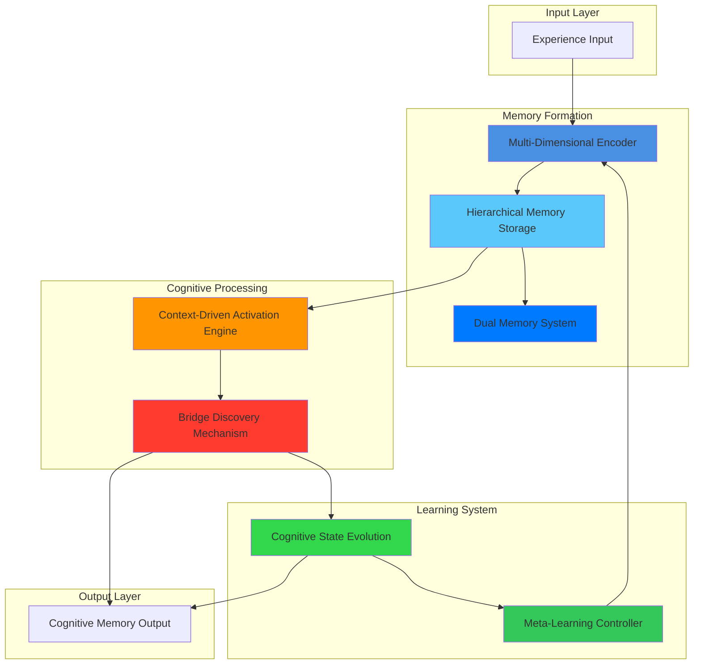
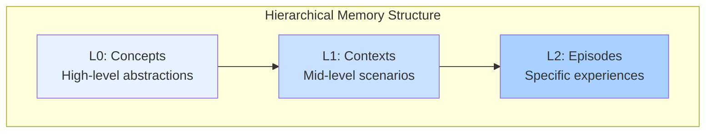
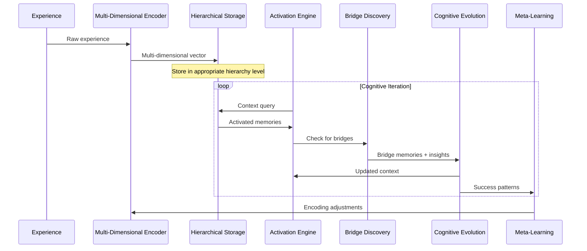

# True Cognitive Memory System Architecture Plan

## Executive Overview

This document presents the architectural plan for implementing a true cognitive memory system for Large Language Models. The system transcends traditional retrieval mechanisms by modeling human cognitive processes, enabling associative thinking, serendipitous connections, and emergent insights through multi-dimensional memory representation and dynamic activation patterns.

## System Architecture

The cognitive memory system consists of six interconnected components that work in concert to create genuine cognitive capabilities. Each component serves a specific function while contributing to the overall emergent intelligence of the system.

## Core Components

### Multi-Dimensional Memory Encoder

The foundation of the system lies in its ability to encode experiences as rich, multi-dimensional vectors. Unlike traditional embeddings that capture only semantic meaning, this encoder extracts multiple dimensions from each experience including semantic, emotional, temporal, contextual, and social aspects. The encoder transforms raw interactions into high-dimensional vectors in ℝᵈ space, where each dimension represents a different facet of the memory. This multi-modal encoding enables the system to capture the full richness of human-like memory formation.

### Hierarchical Memory Storage

To address computational complexity while maintaining cognitive authenticity, the system organizes memories in a three-tier hierarchy. The conceptual layer (L0) contains high-level abstractions such as authentication, performance, or debugging concepts. The contextual layer (L1) holds mid-level scenarios like specific debugging sessions or optimization tasks. The episodic layer (L2) stores detailed memories of specific experiences with their full contextual richness. This hierarchical structure enables O(log n) retrieval complexity through efficient traversal while maintaining the ability to access detailed memories when needed.

### Dual Memory System

The architecture implements a biologically-inspired dual memory system that mirrors human episodic and semantic memory. Episodic memory stores recent, specific interactions with full contextual detail and implements fast decay rates measured in days to weeks. Semantic memory contains distilled patterns and generalized knowledge with slow decay rates extending to months or years. The memory consolidation process continuously identifies recurring patterns in episodic memories and promotes frequently accessed patterns to semantic memory while compressing source episodes to maintain efficiency.

### Context-Driven Activation Engine

This component implements the core cognitive retrieval mechanism through activation spreading and resonance. Rather than simple similarity matching, the engine generates context vectors from the current cognitive state and implements sparse activation networks for computational efficiency. The activation spreads iteratively through memory connections, identifying three types of memories: core memories with high direct similarity, peripheral memories with moderate activation, and bridge memories that enable serendipitous connections.

### Bridge Discovery Mechanism

The system's ability to generate "aha moments" emerges from the sophisticated bridge discovery mechanism. This component identifies memories with low direct similarity to the current context but high connection potential through intermediate memories. Using attention-based probabilistic sampling instead of exhaustive search, it computes bridge quality scores based on novelty, connection strength, and relevance potential. This mechanism enables the kind of unexpected connections that characterize human creativity and insight.

### Meta-Learning Controller

The meta-learning controller enables continuous improvement of the memory system. It tracks successful retrieval patterns and outcomes, adjusting dimension weights based on effectiveness and updating encoding strategies for improved memory formation. This component ensures that the system becomes more effective over time, learning which dimensions are most important for different types of memories and which connection patterns lead to valuable insights.

## Key Interactions and Relationships

The system operates through several primary information flows that create its cognitive capabilities. New experiences flow from the encoder through the hierarchical storage system, where they are placed at appropriate levels and connected to existing memories. The current context generates query vectors that trigger activation spreading through the memory network, retrieving relevant memories across all three categories. These retrieved memories then influence the current cognitive state, creating an iterative process that enables genuine cognitive flow.

## Mathematical Framework

The system implements the mathematical framework through several key mechanisms. Memory encoding uses the function E: Experience → ℝᵈ, where each memory vector combines weighted contributions from different modalities. The activation spreading algorithm implements iterative propagation through connection strengths, with activation at time τ calculated as a combination of decay from previous activation and spreading from connected memories. Bridge discovery uses attention mechanisms to efficiently identify promising connections without exhaustive search, computing bridge probability as the product of attention scores, novelty scores, and relevance potential.

## Implementation Phasing

### Phase 1: Foundation (Weeks 1-4)

The initial phase establishes the core infrastructure with basic multi-dimensional encoding capabilities. This phase implements simple episodic and semantic memory stores with basic consolidation mechanisms. The retrieval system uses cosine similarity with recency bias to provide functional memory capabilities while laying the groundwork for more sophisticated mechanisms.

### Phase 2: Cognitive Enhancement (Weeks 5-8)

The second phase introduces the full multi-dimensional encoding system with learned dimension weights. The hierarchical memory organization is deployed, enabling efficient navigation through conceptual, contextual, and episodic layers. Sparse activation networks replace simple similarity matching, creating the foundation for genuine cognitive retrieval.

### Phase 3: Emergent Intelligence (Weeks 9-12)

The final phase implements the attention-based bridge discovery mechanism and deploys the meta-learning controller. This phase enables full cognitive iteration with context evolution, creating a system capable of generating genuine insights through serendipitous connections. The complete system demonstrates emergent cognitive behaviors that mirror human memory and insight generation.

## Critical Design Decisions

The architecture makes several key design decisions to balance computational efficiency with cognitive authenticity. The hierarchical organization reduces search complexity from O(n) to O(log n) while maintaining rich memory representation. Sparse activation networks limit computational overhead while preserving the ability to discover distant connections. Attention-based bridge discovery avoids exhaustive search while maintaining the serendipitous discovery capability essential for genuine insights.

## Conclusion

This cognitive memory architecture represents a fundamental shift from information retrieval to genuine cognitive processing. By implementing mathematical models of human memory mechanisms including multi-dimensional encoding, activation spreading, and bridge discovery, the system enables Large Language Models to develop true associative intelligence. The phased implementation approach ensures practical deployment while maintaining the ambitious vision of creating artificial intelligence systems that think, remember, and discover insights in fundamentally human-like ways.
