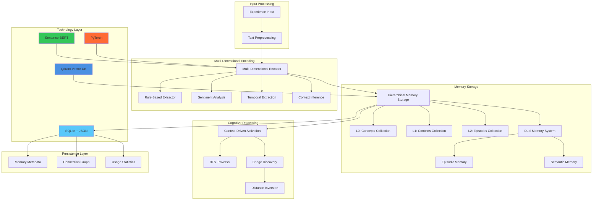

# Cognitive Memory System: Technical Architecture Specification

## Executive Overview

This document extends the high-level architecture plan with concrete technical decisions and implementation details for the cognitive memory system. The system implements true cognitive processing for Large Language Models using Python 3.13, enabling associative thinking, serendipitous connections, and emergent insights through multi-dimensional memory representation and dynamic activation patterns.

## Technology Stack and Design Decisions

### Core Infrastructure Stack

| Component | Technology Choice | Rationale | Alternative Considered |
|-----------|------------------|-----------|----------------------|
| **Vector Database** | Qdrant | Production-ready, hierarchical collections, Python 3.13 compatible | Chroma, Weaviate, Custom NetworkX |
| **ML Framework** | PyTorch | Research flexibility, transformers ecosystem, dynamic graphs | JAX, TensorFlow |
| **Base Embeddings** | Sentence-BERT (all-MiniLM-L6-v2) | Fast local inference, fine-tunable, 384D vectors | OpenAI embeddings, BGE-M3, CodeBERT |
| **Memory Persistence** | SQLite + JSON | Zero-setup, ACID transactions, flexible schema evolution | PostgreSQL, File-based |
| **Programming Language** | Python 3.13 | Latest features, async support, type hints | - |

### Cognitive Architecture Components

| Component | Implementation Approach | Technical Details |
|-----------|------------------------|------------------|
| **Dimension Extraction** | Rule-based + ML Hybrid | Regex patterns + sentiment analysis + learned classifiers |
| **Activation Algorithm** | Qdrant Collections + BFS | 3-collection hierarchy with breadth-first activation spreading |
| **Bridge Discovery** | Simple Distance Inversion | Inverse similarity scoring with connection potential weighting |
| **Memory Consolidation** | Time-based + Pattern-based | Episodic→Semantic promotion based on access frequency |

### Infrastructure Components

| Component | Technology Choice | Technical Details |
|-----------|------------------|------------------|
| **Configuration** | .env files | Environment-specific settings with python-dotenv |
| **Logging** | Loguru | Structured logging for cognitive events and debugging |
| **API Interfaces** | CLI + MCP + HTTP | Multiple interfaces to cognitive core system |
| **Deployment** | Local-only | Single-machine development and testing |

## System Architecture

### Enhanced Component Diagram



## Technical Implementation Details

### Multi-Dimensional Encoding Implementation

#### Dimension Extraction Strategy
```python
class DimensionExtractor:
    """Hybrid rule-based + ML approach for multi-modal dimension extraction"""
    
    def __init__(self):
        self.emotional_analyzer = SentimentPipeline("distilbert-base-uncased-finetuned-sst-2-english")
        self.temporal_patterns = self._load_temporal_regex_patterns()
        self.context_classifier = self._initialize_context_classifier()
        
    def extract_dimensions(self, text: str) -> Dict[str, torch.Tensor]:
        """Extract emotional, temporal, contextual, social dimensions from text"""
        return {
            'emotional': self._extract_emotional_dimension(text),
            'temporal': self._extract_temporal_dimension(text), 
            'contextual': self._extract_contextual_dimension(text),
            'social': self._extract_social_dimension(text)
        }
    
    def _extract_emotional_dimension(self, text: str) -> torch.Tensor:
        """Extract frustration, satisfaction, curiosity, stress indicators"""
        # Sentiment analysis + frustration patterns + satisfaction indicators
        sentiment = self.emotional_analyzer(text)
        frustration_score = self._detect_frustration_patterns(text)
        satisfaction_score = self._detect_satisfaction_patterns(text)
        curiosity_score = self._detect_curiosity_patterns(text)
        stress_score = self._detect_stress_indicators(text)
        
        return torch.tensor([frustration_score, satisfaction_score, 
                           curiosity_score, stress_score])
    
    def _extract_temporal_dimension(self, text: str) -> torch.Tensor:
        """Extract urgency, deadline pressure, time context"""
        urgency_score = self._detect_urgency_patterns(text)
        deadline_score = self._detect_deadline_patterns(text) 
        time_context = self._extract_time_references(text)
        
        return torch.tensor([urgency_score, deadline_score, time_context])
```

#### Base Embedding Integration
```python
class CognitiveEncoder(nn.Module):
    """Combines Sentence-BERT with multi-dimensional extraction"""
    
    def __init__(self, base_model_name: str = "all-MiniLM-L6-v2"):
        super().__init__()
        self.sentence_bert = SentenceTransformer(base_model_name)
        self.dimension_extractor = DimensionExtractor()
        
        # Dimension fusion layers
        self.semantic_dim = 384  # Sentence-BERT output dimension
        self.emotional_dim = 4
        self.temporal_dim = 3
        self.contextual_dim = 6
        self.social_dim = 3
        
        # Learned fusion weights
        self.fusion_layer = nn.Linear(
            self.semantic_dim + self.emotional_dim + self.temporal_dim + 
            self.contextual_dim + self.social_dim, 
            512  # Final cognitive embedding dimension
        )
        
    def encode_memory(self, experience_text: str) -> torch.Tensor:
        """Encode experience into multi-dimensional cognitive vector"""
        # Semantic embedding from Sentence-BERT
        semantic_embedding = torch.tensor(
            self.sentence_bert.encode(experience_text)
        )
        
        # Multi-dimensional extraction
        dimensions = self.dimension_extractor.extract_dimensions(experience_text)
        
        # Concatenate all dimensions
        multi_dim_vector = torch.cat([
            semantic_embedding,
            dimensions['emotional'],
            dimensions['temporal'], 
            dimensions['contextual'],
            dimensions['social']
        ])
        
        # Learned fusion
        cognitive_embedding = self.fusion_layer(multi_dim_vector)
        
        return cognitive_embedding
```

### Hierarchical Memory Storage with Qdrant

#### Collection Architecture
```python
class HierarchicalMemoryStorage:
    """3-tier hierarchy using Qdrant collections"""
    
    def __init__(self, qdrant_client: QdrantClient):
        self.client = qdrant_client
        self.collections = {
            'concepts_l0': 'cognitive_concepts',
            'contexts_l1': 'cognitive_contexts', 
            'episodes_l2': 'cognitive_episodes'
        }
        self._initialize_collections()
    
    def _initialize_collections(self):
        """Initialize Qdrant collections for hierarchical storage"""
        for level, collection_name in self.collections.items():
            self.client.create_collection(
                collection_name=collection_name,
                vectors_config=VectorParams(
                    size=512,  # Cognitive embedding dimension
                    distance=Distance.COSINE
                ),
                optimizers_config=OptimizersConfig(
                    default_segment_number=2,
                    memmap_threshold=20000
                )
            )
    
    def store_memory(self, memory: CognitiveMemory, level: int):
        """Store memory at appropriate hierarchy level"""
        collection_name = list(self.collections.values())[level]
        
        self.client.upsert(
            collection_name=collection_name,
            points=[PointStruct(
                id=memory.id,
                vector=memory.cognitive_embedding.tolist(),
                payload={
                    'content': memory.content,
                    'dimensions': memory.dimensions,
                    'timestamp': memory.timestamp.isoformat(),
                    'level': level,
                    'parent_id': memory.parent_id,
                    'access_count': memory.access_count,
                    'importance_score': memory.importance_score
                }
            )]
        )
```

#### Activation Spreading with BFS
```python
class ActivationEngine:
    """Context-driven activation using Qdrant + BFS traversal"""
    
    def __init__(self, memory_storage: HierarchicalMemoryStorage, 
                 connection_graph: ConnectionGraph):
        self.storage = memory_storage
        self.connections = connection_graph
        
    def activate_memories(self, context_vector: torch.Tensor, 
                         activation_threshold: float = 0.7,
                         max_activations: int = 50) -> ActivationResult:
        """Hierarchical activation spreading through memory levels"""
        
        # Phase 1: Activate L0 concepts
        l0_matches = self.storage.search_level(
            level=0, 
            query_vector=context_vector, 
            limit=10,
            score_threshold=activation_threshold
        )
        
        activated_memories = set()
        activation_queue = deque(l0_matches)
        
        # Phase 2: BFS through hierarchy
        while activation_queue and len(activated_memories) < max_activations:
            current_memory = activation_queue.popleft()
            
            if current_memory.id in activated_memories:
                continue
                
            activated_memories.add(current_memory.id)
            
            # Find connected memories
            connected = self.connections.get_connections(
                current_memory.id, 
                min_strength=activation_threshold
            )
            
            # Add to queue for further activation
            for connected_memory in connected:
                if connected_memory.id not in activated_memories:
                    activation_queue.append(connected_memory)
        
        return ActivationResult(
            core_memories=l0_matches[:5],
            peripheral_memories=list(activated_memories)[5:],
            activation_strength=self._compute_activation_strengths(activated_memories)
        )
```

### Bridge Discovery Implementation

#### Simple Distance Inversion Algorithm
```python
class BridgeDiscovery:
    """Simple distance inversion for serendipitous connections"""
    
    def __init__(self, memory_storage: HierarchicalMemoryStorage):
        self.storage = memory_storage
        
    def discover_bridges(self, query_context: torch.Tensor,
                        activated_memories: List[CognitiveMemory],
                        k: int = 5) -> List[BridgeMemory]:
        """Find distant but potentially connected memories"""
        
        # Get all non-activated memories
        all_memories = self.storage.get_all_memories()
        activated_ids = {m.id for m in activated_memories}
        candidates = [m for m in all_memories if m.id not in activated_ids]
        
        bridge_scores = []
        
        for candidate in candidates:
            # Compute novelty (inverse similarity to query)
            direct_similarity = torch.cosine_similarity(
                query_context, candidate.cognitive_embedding, dim=0
            )
            novelty_score = 1.0 - direct_similarity.item()
            
            # Compute connection potential to activated memories
            connection_potential = 0.0
            for activated_memory in activated_memories:
                similarity = torch.cosine_similarity(
                    candidate.cognitive_embedding,
                    activated_memory.cognitive_embedding,
                    dim=0
                )
                connection_potential = max(connection_potential, similarity.item())
            
            # Combined bridge score
            bridge_score = (novelty_score * 0.6) + (connection_potential * 0.4)
            
            bridge_scores.append(BridgeMemory(
                memory=candidate,
                novelty_score=novelty_score,
                connection_potential=connection_potential,
                bridge_score=bridge_score
            ))
        
        # Return top-k bridges
        return sorted(bridge_scores, key=lambda x: x.bridge_score, reverse=True)[:k]
```

### Memory Persistence with SQLite

#### Database Schema
```sql
-- Memory metadata and relationships
CREATE TABLE memories (
    id TEXT PRIMARY KEY,
    level INTEGER NOT NULL,  -- 0=concept, 1=context, 2=episode
    content TEXT NOT NULL,
    dimensions_json TEXT NOT NULL,  -- Multi-dimensional data
    qdrant_id TEXT NOT NULL,  -- Reference to Qdrant vector
    timestamp DATETIME NOT NULL,
    last_accessed DATETIME NOT NULL,
    access_count INTEGER DEFAULT 0,
    importance_score REAL DEFAULT 0.0,
    parent_id TEXT,  -- Hierarchical relationship
    memory_type TEXT DEFAULT 'episodic',  -- episodic/semantic
    decay_rate REAL DEFAULT 0.1,
    FOREIGN KEY (parent_id) REFERENCES memories(id)
);

-- Connection graph for activation spreading
CREATE TABLE memory_connections (
    source_id TEXT NOT NULL,
    target_id TEXT NOT NULL,
    connection_strength REAL NOT NULL,
    connection_type TEXT DEFAULT 'associative',
    created_at DATETIME NOT NULL,
    last_activated DATETIME,
    activation_count INTEGER DEFAULT 0,
    PRIMARY KEY (source_id, target_id),
    FOREIGN KEY (source_id) REFERENCES memories(id),
    FOREIGN KEY (target_id) REFERENCES memories(id)
);

-- Bridge discovery cache
CREATE TABLE bridge_cache (
    query_hash TEXT NOT NULL,
    bridge_memory_id TEXT NOT NULL,
    bridge_score REAL NOT NULL,
    novelty_score REAL NOT NULL,
    connection_potential REAL NOT NULL,
    created_at DATETIME NOT NULL,
    PRIMARY KEY (query_hash, bridge_memory_id),
    FOREIGN KEY (bridge_memory_id) REFERENCES memories(id)
);

-- Usage statistics for meta-learning
CREATE TABLE retrieval_stats (
    id INTEGER PRIMARY KEY AUTOINCREMENT,
    query_hash TEXT NOT NULL,
    memory_id TEXT NOT NULL,
    retrieval_type TEXT NOT NULL,  -- core/peripheral/bridge
    success_score REAL,
    timestamp DATETIME NOT NULL,
    FOREIGN KEY (memory_id) REFERENCES memories(id)
);

-- Indexes for performance
CREATE INDEX idx_memories_level ON memories(level);
CREATE INDEX idx_memories_timestamp ON memories(timestamp);
CREATE INDEX idx_memories_access_count ON memories(access_count);
CREATE INDEX idx_connections_strength ON memory_connections(connection_strength);
CREATE INDEX idx_bridge_cache_query ON bridge_cache(query_hash);
```

#### Dual Memory System Implementation
```python
class DualMemorySystem:
    """Episodic and semantic memory with consolidation"""
    
    def __init__(self, sqlite_conn: sqlite3.Connection):
        self.db = sqlite_conn
        self.episodic_decay_rate = 0.1  # Fast decay (days)
        self.semantic_decay_rate = 0.01  # Slow decay (months)
        
    def store_episodic_memory(self, memory: CognitiveMemory):
        """Store new episodic memory with fast decay"""
        self.db.execute("""
            INSERT INTO memories (
                id, level, content, dimensions_json, qdrant_id,
                timestamp, last_accessed, memory_type, decay_rate
            ) VALUES (?, ?, ?, ?, ?, ?, ?, 'episodic', ?)
        """, (
            memory.id, memory.level, memory.content,
            json.dumps(memory.dimensions), memory.qdrant_id,
            memory.timestamp, memory.timestamp, self.episodic_decay_rate
        ))
        
    def consolidate_to_semantic(self, pattern_memories: List[CognitiveMemory]):
        """Promote frequently accessed patterns to semantic memory"""
        for memory in pattern_memories:
            # Create semantic memory from pattern
            semantic_memory = self._extract_semantic_pattern(memory)
            
            # Store with slow decay
            self.db.execute("""
                INSERT INTO memories (
                    id, level, content, dimensions_json, qdrant_id,
                    timestamp, last_accessed, memory_type, decay_rate,
                    importance_score
                ) VALUES (?, ?, ?, ?, ?, ?, ?, 'semantic', ?, ?)
            """, (
                semantic_memory.id, semantic_memory.level,
                semantic_memory.content, json.dumps(semantic_memory.dimensions),
                semantic_memory.qdrant_id, semantic_memory.timestamp,
                semantic_memory.timestamp, self.semantic_decay_rate,
                semantic_memory.importance_score
            ))
            
            # Compress original episodic memories
            self._compress_episodic_sources(pattern_memories)
```

## Interface Design for Extensibility

All critical components are wrapped in abstract interfaces to enable easy swapping and scaling:

```python
from abc import ABC, abstractmethod
from typing import List, Dict, Any, Optional

class EmbeddingProvider(ABC):
    """Abstract interface for embedding models"""
    
    @abstractmethod
    def encode(self, text: str) -> torch.Tensor:
        pass
    
    @abstractmethod
    def encode_batch(self, texts: List[str]) -> torch.Tensor:
        pass

class VectorStorage(ABC):
    """Abstract interface for vector databases"""
    
    @abstractmethod
    def store_vector(self, id: str, vector: torch.Tensor, metadata: Dict[str, Any]):
        pass
    
    @abstractmethod
    def search_similar(self, query_vector: torch.Tensor, k: int, 
                      filters: Optional[Dict] = None) -> List[SearchResult]:
        pass

class ActivationEngine(ABC):
    """Abstract interface for memory activation"""
    
    @abstractmethod
    def activate_memories(self, context: torch.Tensor, 
                         threshold: float) -> ActivationResult:
        pass

class BridgeDiscovery(ABC):
    """Abstract interface for bridge discovery algorithms"""
    
    @abstractmethod
    def discover_bridges(self, context: torch.Tensor,
                        activated: List[CognitiveMemory],
                        k: int) -> List[BridgeMemory]:
        pass
```

## Implementation Phasing with Technical Details

### Phase 1: Foundation (Weeks 1-4)
**Technical Deliverables:**
- SQLite database schema and basic CRUD operations
- Sentence-BERT integration with dimension extraction
- Basic Qdrant collections setup
- Simple similarity-based retrieval
- Rule-based dimension extraction (emotional, temporal, contextual)

**Code Structure:**
```
cognitive_memory/
├── core/
│   ├── interfaces.py          # Abstract interfaces
│   ├── memory.py             # CognitiveMemory data structures
│   └── config.py             # Configuration management
├── encoding/
│   ├── sentence_bert.py      # SentenceBERT implementation
│   ├── dimensions.py         # Rule-based dimension extraction
│   └── cognitive_encoder.py  # Multi-dimensional encoding
├── storage/
│   ├── qdrant_storage.py     # Qdrant vector storage
│   ├── sqlite_persistence.py # SQLite metadata storage
│   └── dual_memory.py        # Episodic/semantic system
├── retrieval/
│   ├── basic_activation.py   # Simple activation spreading
│   └── similarity_search.py  # Cosine similarity retrieval
└── tests/
    └── integration/          # End-to-end testing
```

### Phase 2: Cognitive Enhancement (Weeks 5-8)
**Technical Deliverables:**
- Full multi-dimensional encoding with learned fusion
- Hierarchical memory organization (L0→L1→L2)
- BFS activation spreading through Qdrant collections
- Connection graph tracking in SQLite
- Simple distance inversion bridge discovery

### Phase 3: Emergent Intelligence (Weeks 9-12)
**Technical Deliverables:**
- Meta-learning controller for adaptive encoding
- Advanced bridge discovery with attention mechanisms
- Memory consolidation automation
- Performance optimization and scaling
- Comprehensive evaluation metrics

## Performance Considerations

### Computational Complexity
- **Memory Encoding**: O(1) per experience with Sentence-BERT
- **Hierarchical Search**: O(log n) through Qdrant collections
- **Activation Spreading**: O(k) where k = max_activations (bounded)
- **Bridge Discovery**: O(m) where m = candidate_memories (limited by sampling)

### Memory Requirements
- **Base Embeddings**: 384D float32 = 1.5KB per memory
- **Multi-dimensional Extensions**: +64 bytes per memory for dimensions
- **SQLite Metadata**: ~1KB per memory for full metadata
- **Qdrant Vectors**: Compressed storage with quantization options

### Scalability Targets
- **Phase 1**: 10K memories, single-user, local deployment
- **Phase 2**: 100K memories, multi-user, containerized deployment  
- **Phase 3**: 1M+ memories, distributed deployment, horizontal scaling

## Quality Assurance and Testing

### Testing Strategy
1. **Unit Tests**: Each interface implementation tested independently
2. **Integration Tests**: End-to-end cognitive workflows
3. **Performance Tests**: Latency and throughput benchmarks
4. **Cognitive Tests**: Evaluation of bridge discovery quality
5. **Regression Tests**: Ensure upgrades maintain cognitive fidelity

### Evaluation Metrics
- **Retrieval Quality**: Precision@K, Recall@K for different memory types
- **Bridge Discovery**: Novelty score, connection relevance, user feedback
- **Consolidation Success**: Pattern extraction accuracy, compression ratios
- **System Performance**: Query latency, memory usage, throughput

## Development Environment and Code Quality

### Environment Setup
- **Python Environment**: `virtualenv` with Python 3.13
- **Dependency Management**: `pip-tools` with `requirements.in` → `requirements.txt`
- **Development Tools**: Separate `requirements-dev.txt` for linting/testing

### Code Quality Standards
- **Linting**: `ruff` (fast Python linter) + `mypy` (type checking) + `black` (formatting)
- **Code Smell Detection**: SonarQube integration for maintainability analysis
- **Import Organization**: `isort` for consistent import sorting

### Git Workflow and Quality Gates
**Pre-commit Requirements** (enforced on every commit):
- `ruff check` - Python linting and code style validation
- `ruff format` - Automatic code formatting
- `mypy` - Static type checking
- `pytest` - Run test suite
- Custom architecture validation - Ensure interface compliance

**Quality Thresholds**:
- Maximum cyclomatic complexity: 10
- Test coverage requirement: 85% for core cognitive components
- SonarQube maintainability rating: A
- Zero code smells in cognitive architecture components

## Configuration and Infrastructure

### Configuration Management
```bash
# .env file structure
QDRANT_URL=http://localhost:6333
QDRANT_API_KEY=optional_key
SQLITE_PATH=./data/cognitive_memory.db
SENTENCE_BERT_MODEL=all-MiniLM-L6-v2
LOG_LEVEL=INFO
ACTIVATION_THRESHOLD=0.7
BRIDGE_DISCOVERY_K=5
```

### Logging Strategy with Loguru
```python
# Cognitive event logging
logger.info("Memory formation", experience_id=uuid, dimensions=extracted_dims)
logger.debug("Activation spreading", activated_count=42, threshold=0.7)
logger.warning("Bridge discovery yielded no results", query_context=context_summary)
logger.error("Qdrant connection failed", error=str(e))
```

### API Interface Architecture
```
Core Cognitive System
        │
        ├── CLI Interface (cognitive-cli)
        ├── MCP Protocol (JSON-RPC server)
        └── HTTP API (FastAPI/Flask)
```

**API Operations**:
- `store_experience(text, context)` - Form new memory
- `retrieve_memories(query, types=['core', 'peripheral', 'bridge'])` - Cognitive retrieval
- `get_memory_stats()` - System state and metrics
- `consolidate_memories()` - Trigger episodic→semantic consolidation

**Project Structure**:
```
cognitive-memory/
├── .env                      # Configuration
├── .pre-commit-config.yaml   # Git hook configuration
├── pyproject.toml           # Python project settings
├── requirements.in/.txt     # Dependencies
├── sonar-project.properties # SonarQube configuration
├── cognitive_memory/        # Core system
│   ├── core/               # Cognitive interfaces and models
│   ├── encoding/           # Multi-dimensional encoding
│   ├── storage/            # Memory persistence
│   ├── retrieval/          # Activation and bridge discovery
│   └── config.py           # Configuration management
├── interfaces/             # API implementations
│   ├── cli.py             # Command-line interface
│   ├── mcp_server.py      # MCP protocol server
│   └── http_api.py        # HTTP REST API
├── data/                  # Local data storage
│   ├── cognitive_memory.db # SQLite database
│   └── models/            # Downloaded models
└── scripts/               # Development utilities
    └── validate-architecture.py
```

## Conclusion

This technical specification provides a concrete implementation path for the cognitive memory system, balancing ambitious cognitive capabilities with practical engineering constraints. The interface-driven architecture enables rapid iteration and component swapping, while the phased approach ensures deliverable milestones throughout development.

The chosen technology stack (Qdrant + PyTorch + Sentence-BERT + SQLite) provides the optimal balance of cognitive fidelity, development speed, and operational simplicity for the initial implementation, with clear upgrade paths for scaling and enhancement.