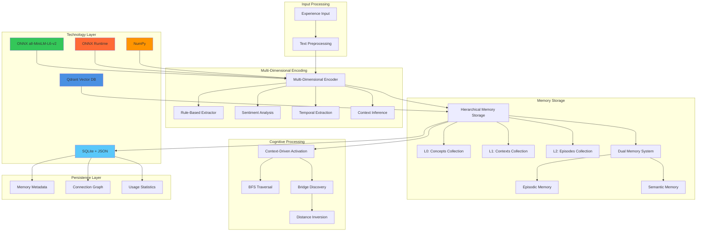

# Cognitive Memory System: Technical Architecture Specification

## Executive Overview

This document extends the high-level architecture plan with concrete technical decisions and implementation details for the cognitive memory system. The system implements true cognitive processing for Large Language Models using Python 3.13, enabling associative thinking, serendipitous connections, and emergent insights through multi-dimensional memory representation and dynamic activation patterns.

## Technology Stack and Design Decisions

### Core Infrastructure Stack

| Component | Technology Choice | Rationale | Alternative Considered |
|-----------|------------------|-----------|----------------------|
| **Vector Database** | Qdrant | Production-ready, hierarchical collections, Python 3.13 compatible | Chroma, Weaviate, Custom NetworkX |
| **ML Framework** | ONNX Runtime + NumPy | Production deployment, 920MB smaller images, CPU-optimized | PyTorch, JAX, TensorFlow |
| **Base Embeddings** | ONNX all-MiniLM-L6-v2 | Fast local inference, ONNX-optimized, 384D vectors | Sentence-BERT, OpenAI embeddings, BGE-M3 |
| **Memory Persistence** | SQLite + JSON | Zero-setup, ACID transactions, flexible schema evolution | PostgreSQL, File-based |
| **Programming Language** | Python 3.13 | Latest features, async support, type hints | - |

### Cognitive Architecture Components

| Component | Implementation Approach | Technical Details |
|-----------|------------------------|------------------|
| **Dimension Extraction** | Rule-based + ML Hybrid | Regex patterns + sentiment analysis + learned classifiers |
| **Activation Algorithm** | Qdrant Collections + BFS | 3-collection hierarchy with breadth-first activation spreading |
| **Bridge Discovery** | Simple Distance Inversion | Inverse similarity scoring with connection potential weighting |
| **Memory Consolidation** | Time-based + Pattern-based | Episodic→Semantic promotion based on access frequency |

### Infrastructure Components

| Component | Technology Choice | Technical Details |
|-----------|------------------|------------------|
| **Configuration** | .env files | Environment-specific settings with python-dotenv |
| **Logging** | Loguru | Structured logging for cognitive events and debugging |
| **API Interfaces** | CLI + MCP + HTTP | Multiple interfaces to cognitive core system |
| **Deployment** | Local-only | Single-machine development and testing |

## System Architecture

### Enhanced Component Diagram



## Technical Implementation Details

### Multi-Dimensional Encoding Implementation

#### Dimension Extraction Strategy
- **Emotional Dimensions**: VADER sentiment analysis + pattern recognition
- **Temporal Dimensions**: Regex patterns for urgency and deadline detection  
- **Contextual Dimensions**: Rule-based classification of content types
- **Social Dimensions**: Interaction pattern detection

#### Base Embedding Integration
- **ONNX Model Loading**: Direct ONNX Runtime inference for all-MiniLM-L6-v2
- **Dimension Fusion**: NumPy-based concatenation of semantic + dimensional vectors
- **Vector Dimensions**: 384D semantic + 16D multi-dimensional = 400D final embeddings
- **Performance**: CPU-optimized inference, 2-3x faster than PyTorch equivalent

### Hierarchical Memory Storage with Qdrant

#### Collection Architecture
- **3-Tier Collections**: `cognitive_concepts` (L0), `cognitive_contexts` (L1), `cognitive_episodes` (L2)
- **Vector Configuration**: 400D embeddings with cosine distance
- **Optimization**: Memory-mapped storage for large datasets
- **Payload Storage**: Rich metadata including hierarchy level, importance scores, timestamps

#### Activation Spreading with BFS
- **Two-Phase Process**: Initial L0 concept activation, then BFS through connection graph
- **Configurable Thresholds**: Activation threshold (0.7) and maximum activations (50)
- **Connection Graph**: SQLite-based memory relationships with strength scoring
- **Result Classification**: Core memories (highest activation) vs peripheral memories

### Bridge Discovery Implementation

#### Distance Inversion Algorithm
- **Novelty Scoring**: Inverse similarity to query (1.0 - cosine_similarity)
- **Connection Potential**: Maximum similarity to any activated memory
- **Bridge Score**: Weighted combination (60% novelty + 40% connection potential)
- **Serendipitous Discovery**: Finds unexpected connections between distant concepts

### Memory Persistence with SQLite

#### Database Schema
```sql
-- Memory metadata and relationships
CREATE TABLE memories (
    id TEXT PRIMARY KEY,
    level INTEGER NOT NULL,  -- 0=concept, 1=context, 2=episode
    content TEXT NOT NULL,
    dimensions_json TEXT NOT NULL,  -- Multi-dimensional data
    qdrant_id TEXT NOT NULL,  -- Reference to Qdrant vector
    timestamp DATETIME NOT NULL,
    last_accessed DATETIME NOT NULL,
    access_count INTEGER DEFAULT 0,
    importance_score REAL DEFAULT 0.0,
    parent_id TEXT,  -- Hierarchical relationship
    memory_type TEXT DEFAULT 'episodic',  -- episodic/semantic
    decay_rate REAL DEFAULT 0.1,
    FOREIGN KEY (parent_id) REFERENCES memories(id)
);

-- Connection graph for activation spreading
CREATE TABLE memory_connections (
    source_id TEXT NOT NULL,
    target_id TEXT NOT NULL,
    connection_strength REAL NOT NULL,
    connection_type TEXT DEFAULT 'associative',
    created_at DATETIME NOT NULL,
    last_activated DATETIME,
    activation_count INTEGER DEFAULT 0,
    PRIMARY KEY (source_id, target_id),
    FOREIGN KEY (source_id) REFERENCES memories(id),
    FOREIGN KEY (target_id) REFERENCES memories(id)
);

-- Bridge discovery cache
CREATE TABLE bridge_cache (
    query_hash TEXT NOT NULL,
    bridge_memory_id TEXT NOT NULL,
    bridge_score REAL NOT NULL,
    novelty_score REAL NOT NULL,
    connection_potential REAL NOT NULL,
    created_at DATETIME NOT NULL,
    PRIMARY KEY (query_hash, bridge_memory_id),
    FOREIGN KEY (bridge_memory_id) REFERENCES memories(id)
);

-- Usage statistics for meta-learning
CREATE TABLE retrieval_stats (
    id INTEGER PRIMARY KEY AUTOINCREMENT,
    query_hash TEXT NOT NULL,
    memory_id TEXT NOT NULL,
    retrieval_type TEXT NOT NULL,  -- core/peripheral/bridge
    success_score REAL,
    timestamp DATETIME NOT NULL,
    FOREIGN KEY (memory_id) REFERENCES memories(id)
);

-- Indexes for performance
CREATE INDEX idx_memories_level ON memories(level);
CREATE INDEX idx_memories_timestamp ON memories(timestamp);
CREATE INDEX idx_memories_access_count ON memories(access_count);
CREATE INDEX idx_connections_strength ON memory_connections(connection_strength);
CREATE INDEX idx_bridge_cache_query ON bridge_cache(query_hash);
```

#### Dual Memory System Implementation
- **Episodic Storage**: Fast decay (0.1/day), temporary experiences, automatic cleanup
- **Semantic Storage**: Slow decay (0.01/day), consolidated patterns, long-term retention
- **Consolidation Process**: Promotes frequently accessed episodic memories to semantic
- **SQLite Integration**: Unified schema with memory_type field and decay_rate tracking

## Interface Design for Extensibility

All critical components are wrapped in abstract interfaces to enable easy swapping and scaling:

- **EmbeddingProvider**: Abstract interface supporting ONNX, PyTorch, or cloud providers
- **VectorStorage**: Qdrant, Chroma, or custom vector database backends  
- **ActivationEngine**: Pluggable memory activation algorithms
- **BridgeDiscovery**: Swappable serendipity algorithms
- **MemoryLoader**: Content ingestion from markdown, PDFs, code repositories

## Implementation Phasing with Technical Details

### Phase 1: Foundation (Weeks 1-4)
**Technical Deliverables:**
- SQLite database schema and basic CRUD operations
- Sentence-BERT integration with dimension extraction
- Basic Qdrant collections setup
- Simple similarity-based retrieval
- Rule-based dimension extraction (emotional, temporal, contextual)

**Code Structure:**
```
cognitive_memory/
├── core/
│   ├── interfaces.py          # Abstract interfaces (EmbeddingProvider, etc.)
│   ├── memory.py             # CognitiveMemory, BridgeMemory data structures
│   ├── cognitive_system.py   # Main CognitiveSystem orchestrator
│   └── config.py             # System configuration
├── encoding/
│   ├── onnx_provider.py      # ONNX Runtime embedding provider
│   ├── dimensions.py         # Multi-dimensional feature extraction
│   └── cognitive_encoder.py  # Dimension fusion coordinator
├── storage/
│   ├── qdrant_storage.py     # Qdrant vector database operations
│   ├── sqlite_persistence.py # SQLite metadata storage
│   └── dual_memory.py        # Episodic/semantic memory system
├── retrieval/
│   ├── contextual_retrieval.py # Main retrieval coordinator
│   ├── basic_activation.py     # BFS activation spreading
│   └── bridge_discovery.py     # Serendipitous connections
├── git_analysis/
│   ├── commit.py             # Git commit data structures
│   ├── commit_loader.py      # Git history to memory conversion
│   └── history_miner.py      # Git repository analysis
├── loaders/
│   ├── git_loader.py         # Git repository integration
│   ├── markdown_loader.py    # Markdown processing coordinator
│   └── markdown/            # Specialized markdown components
│       ├── content_analyzer.py    # Linguistic analysis
│       ├── document_parser.py     # Markdown parsing
│       ├── memory_factory.py      # Memory creation
│       ├── connection_extractor.py # Relationship analysis
│       └── chunk_processor.py     # Document chunking
└── tests/
    ├── unit/                 # Component-level tests
    ├── integration/          # Cross-component tests
    └── e2e/                  # End-to-end scenarios

interfaces/
├── cli.py                   # CognitiveCLI - main CLI interface
├── mcp_server.py           # MCP protocol server
└── mcp_tools/              # Individual MCP tool implementations

memory_system/
├── cli.py                  # Service management CLI (memory_system command)
├── service_manager.py      # Docker/Qdrant service management
└── interactive_shell.py    # Interactive memory shell

scripts/
├── setup_project_memory.sh    # Project isolation setup
├── load_project_content.sh    # Content loading automation
└── claude_mcp_wrapper.sh      # Claude Code MCP integration
```

### Phase 2: Cognitive Enhancement (Weeks 5-8)
**Technical Deliverables:**
- Full multi-dimensional encoding with learned fusion
- Hierarchical memory organization (L0→L1→L2)
- BFS activation spreading through Qdrant collections
- Connection graph tracking in SQLite
- Simple distance inversion bridge discovery

### Phase 3: Emergent Intelligence (Weeks 9-12)
**Technical Deliverables:**
- Meta-learning controller for adaptive encoding
- Advanced bridge discovery with attention mechanisms
- Memory consolidation automation
- Performance optimization and scaling
- Comprehensive evaluation metrics

## Performance Considerations

### Computational Complexity
- **Memory Encoding**: O(1) per experience with Sentence-BERT
- **Hierarchical Search**: O(log n) through Qdrant collections
- **Activation Spreading**: O(k) where k = max_activations (bounded)
- **Bridge Discovery**: O(m) where m = candidate_memories (limited by sampling)

### Memory Requirements
- **Base Embeddings**: 384D float32 = 1.5KB per memory
- **Multi-dimensional Extensions**: +64 bytes per memory for dimensions
- **SQLite Metadata**: ~1KB per memory for full metadata
- **Qdrant Vectors**: Compressed storage with quantization options

### Scalability Targets
- **Phase 1**: 10K memories, single-user, local deployment
- **Phase 2**: 100K memories, multi-user, containerized deployment
- **Phase 3**: 1M+ memories, distributed deployment, horizontal scaling

## Quality Assurance and Testing

### Testing Strategy
1. **Unit Tests**: Each interface implementation tested independently
2. **Integration Tests**: End-to-end cognitive workflows
3. **Performance Tests**: Latency and throughput benchmarks
4. **Cognitive Tests**: Evaluation of bridge discovery quality
5. **Regression Tests**: Ensure upgrades maintain cognitive fidelity

### Evaluation Metrics
- **Retrieval Quality**: Precision@K, Recall@K for different memory types
- **Bridge Discovery**: Novelty score, connection relevance, user feedback
- **Consolidation Success**: Pattern extraction accuracy, compression ratios
- **System Performance**: Query latency, memory usage, throughput

## Development Environment and Code Quality

### Environment Setup
- **Python Environment**: `virtualenv` with Python 3.13
- **Dependency Management**: `pip-tools` with `requirements.in` → `requirements.txt`
- **Development Tools**: Separate `requirements-dev.txt` for linting/testing

### Code Quality Standards
- **Linting**: `ruff` (fast Python linter) + `mypy` (type checking) + `black` (formatting)
- **Code Smell Detection**: SonarQube integration for maintainability analysis
- **Import Organization**: `isort` for consistent import sorting

### Git Workflow and Quality Gates
**Pre-commit Requirements** (enforced on every commit):
- `ruff check` - Python linting and code style validation
- `ruff format` - Automatic code formatting
- `mypy` - Static type checking
- `pytest` - Run test suite
- Custom architecture validation - Ensure interface compliance

**Quality Thresholds**:
- Maximum cyclomatic complexity: 10
- Test coverage requirement: 85% for core cognitive components
- SonarQube maintainability rating: A
- Zero code smells in cognitive architecture components

## Configuration and Infrastructure

### Configuration Management
```bash
# .env file structure
QDRANT_URL=http://localhost:6333
QDRANT_API_KEY=optional_key
SQLITE_PATH=./data/cognitive_memory.db
SENTENCE_BERT_MODEL=all-MiniLM-L6-v2
LOG_LEVEL=INFO
ACTIVATION_THRESHOLD=0.7
BRIDGE_DISCOVERY_K=5
```

### Logging Strategy with Loguru
```python
# Cognitive event logging
logger.info("Memory formation", experience_id=uuid, dimensions=extracted_dims)
logger.debug("Activation spreading", activated_count=42, threshold=0.7)
logger.warning("Bridge discovery yielded no results", query_context=context_summary)
logger.error("Qdrant connection failed", error=str(e))
```

### Infrastructure Overview and User Interaction

```
┌─────────────────────────────────────────────────────────────────┐
│                    COGNITIVE MEMORY SYSTEM                      │
└─────────────────────────────────────────────────────────────────┘

┌─────────────────────────────────────────────────────────────────┐
│                      USER INTERFACES                           │
├─────────────────┬─────────────────┬─────────────────────────────┤
│   RESEARCHERS   │   WEB CLIENTS   │      AI SYSTEMS/LLMs        │
│                 │                 │                             │
│ $ memory_system │ HTTP Requests   │    MCP Protocol Client      │
│   shell         │ (REST API)      │    (Claude, GPT, etc.)      │
│                 │                 │                             │
│ Interactive     │ Web Dashboard   │ JSON-RPC over TCP/stdin     │
│ CLI Commands    │ API Integration │ Memory operations           │
└─────────────────┴─────────────────┴─────────────────────────────┘
         │                 │                        │
         ▼                 ▼                        ▼
┌─────────────────────────────────────────────────────────────────┐
│                    UNIFIED CLI LAYER                           │
│                memory_system [command]                         │
├─────────────────────────────────────────────────────────────────┤
│ ┌─────────────┐ ┌─────────────┐ ┌─────────────┐ ┌─────────────┐ │
│ │   qdrant    │ │    serve    │ │    shell    │ │   doctor    │ │
│ │   start     │ │    http     │ │ interactive │ │ health      │ │
│ │   stop      │ │    mcp      │ │    REPL     │ │ checks      │ │
│ │   status    │ │             │ │             │ │             │ │
│ └─────────────┘ └─────────────┘ └─────────────┘ └─────────────┘ │
└─────────────────────────────────────────────────────────────────┘
         │
         ▼
┌─────────────────────────────────────────────────────────────────┐
│                  COGNITIVE MEMORY CORE                         │
├─────────────────────────────────────────────────────────────────┤
│  Multi-dimensional Encoding → Storage → Retrieval → Insights   │
│                                                                 │
│  • Experience processing    • Memory formation                  │
│  • Context analysis        • Association building              │
│  • Bridge discovery        • Activation spreading              │
└─────────────────────────────────────────────────────────────────┘
         │
         ▼
┌─────────────────────────────────────────────────────────────────┐
│                    STORAGE LAYER                               │
├─────────────────┬───────────────────────────┬───────────────────┤
│   VECTOR DB     │      METADATA DB          │   SERVICE MGR     │
│                 │                           │                   │
│ ┌─────────────┐ │ ┌─────────────────────────┐ │ ┌─────────────┐ │
│ │   QDRANT    │ │ │        SQLITE           │ │ │  DOCKER     │ │
│ │             │ │ │                         │ │ │ CONTAINER   │ │
│ │ Concepts    │ │ │ • Memory metadata       │ │ │ MANAGER     │ │
│ │ Contexts    │ │ │ • Connection graph      │ │ │             │ │
│ │ Episodes    │ │ │ • Usage statistics      │ │ │ Fallback:   │ │
│ │             │ │ │ • Bridge cache          │ │ │ Local       │ │
│ │ 512D        │ │ │                         │ │ │ Binary      │ │
│ │ Vectors     │ │ │ Relationships & Meta    │ │ │             │ │
│ └─────────────┘ │ └─────────────────────────┘ │ └─────────────┘ │
│                 │                           │                   │
│ Port: 6333      │ File: ./data/memory.db    │ Auto-managed      │
└─────────────────┴───────────────────────────┴───────────────────┘
```

### User Interaction Flows

#### 1. Researcher Workflow
```bash
# One-time setup
$ memory_system doctor              # Check system health
$ memory_system qdrant start       # Start vector database
$ memory_system shell               # Interactive session

# Daily usage
cognitive> store "Working on transformer attention mechanisms"
cognitive> recall "attention patterns"
cognitive> bridges "neural networks"
cognitive> exit
```

#### 2. LLM/AI System Integration (MCP)
```json
# LLM connects via MCP protocol
{
  "jsonrpc": "2.0",
  "method": "memory/store",
  "params": {
    "experience": "User struggling with Python async/await concepts",
    "context": "programming_help_session",
    "dimensions": {
      "emotional": "frustration",
      "temporal": "learning_phase",
      "contextual": "coding_tutorial"
    }
  }
}

# Response with memory formed
{
  "jsonrpc": "2.0",
  "result": {
    "memory_id": "mem_12345",
    "associations": ["async_programming", "python_concepts"],
    "bridges": ["javascript_promises", "concurrent_patterns"]
  }
}
```

#### 3. CLI Integration
```bash
# Direct CLI access
$ cognitive-cli store "Important system insight"
$ cognitive-cli retrieve "machine learning patterns"
```

### Setup Automation Infrastructure

#### Unified CLI Architecture
```python
# memory_system/cli.py
import typer
from typing import Optional

app = typer.Typer(help="Cognitive Memory System")

# Service management commands
qdrant_app = typer.Typer(help="Qdrant vector database management")
app.add_typer(qdrant_app, name="qdrant")

# Server interface commands
serve_app = typer.Typer(help="Start interface servers")
app.add_typer(serve_app, name="serve")

@qdrant_app.command("start")
def qdrant_start(
    port: int = 6333,
    data_dir: Optional[str] = None,
    detach: bool = True,
    force_local: bool = False
):
    """Start Qdrant vector database"""
    pass

@serve_app.command("mcp")
def serve_mcp(
    port: Optional[int] = None,
    stdin: bool = False
):
    """Start MCP protocol server"""
    pass

@app.command("shell")
def interactive_shell():
    """Start interactive cognitive memory shell"""
    pass

@app.command("doctor")
def health_check(
    json_output: bool = False,
    verbose: bool = False
):
    """Run comprehensive health checks"""
    pass
```

#### Service Management Flow
```
Experience Input → Multi-dimensional Encoding → Vector Storage (Qdrant)
                                              → Metadata Storage (SQLite)
                                              → Connection Graph Updates
                                              → Available for Retrieval
```

#### How Components Work Together
1. **Setup Phase**: System checks for Docker, downloads Qdrant binary if needed, creates data directories, initializes collections
2. **Runtime Architecture**: Single `memory_system` command manages everything, handles Qdrant lifecycle, serves CLI/HTTP/MCP interfaces
3. **Persistent Storage**: Memories survive restarts via Docker volumes/local files
4. **AI System Integration**: LLMs connect via MCP for real-time memory operations, context preservation, serendipitous discovery

**API Operations**:
- `store_experience(text, context)` - Form new memory
- `retrieve_memories(query, types=['core', 'peripheral', 'bridge'])` - Cognitive retrieval
- `get_memory_stats()` - System state and metrics
- `consolidate_memories()` - Trigger episodic→semantic consolidation

**Project Structure**:
```
heimdall-mcp-server/
├── .env                      # Environment configuration
├── .pre-commit-config.yaml   # Git hook configuration  
├── pyproject.toml           # Python project settings
├── requirements.txt         # Production dependencies
├── requirements-dev.txt     # Development dependencies
├── CLAUDE.md               # Project instructions for AI assistants
├── cognitive_memory/        # Core cognitive system
│   ├── core/               # System interfaces and orchestration
│   ├── encoding/           # ONNX-based embedding and dimension extraction
│   ├── storage/            # Qdrant + SQLite persistence layer
│   ├── retrieval/          # Memory activation and bridge discovery
│   ├── git_analysis/       # Git commit processing and analysis
│   └── loaders/            # Content ingestion (markdown, git)
├── interfaces/             # External API implementations
│   ├── cli.py             # CognitiveCLI for direct interaction
│   ├── mcp_server.py      # MCP protocol server for Claude Code
│   └── mcp_tools/         # Individual MCP tool implementations
├── memory_system/          # Service management and deployment
│   ├── cli.py             # Main memory_system command
│   ├── service_manager.py  # Docker container orchestration
│   └── interactive_shell.py # Interactive memory operations
├── docker/                 # Container infrastructure
│   ├── Dockerfile         # Cognitive memory container image
│   ├── docker-compose.template.yml # Project-specific containers
│   └── entrypoint.sh      # Container initialization
├── scripts/               # Automation and setup utilities
│   ├── setup_project_memory.sh    # Project isolation setup
│   ├── setup_claude_code_mcp.sh   # Claude Code integration
│   ├── load_project_content.sh    # Batch content loading
│   └── claude_mcp_wrapper.sh      # MCP transport wrapper
├── docs/                  # Architecture and usage documentation
│   ├── arch-docs/         # Technical architecture specifications
│   └── progress/          # Development progress tracking
├── tests/                 # Comprehensive test suite
│   ├── unit/              # Component-level tests
│   ├── integration/       # Cross-component integration tests
│   └── e2e/               # End-to-end system tests
└── data/                  # Local data storage (created at runtime)
    ├── cognitive_memory.db # SQLite metadata database
    └── models/            # ONNX model files
```

## Conclusion

This technical specification provides a concrete implementation path for the cognitive memory system, balancing ambitious cognitive capabilities with practical engineering constraints. The interface-driven architecture enables rapid iteration and component swapping, while the phased approach ensures deliverable milestones throughout development.

The chosen technology stack (Qdrant + ONNX Runtime + NumPy + SQLite) provides the optimal balance of cognitive fidelity, deployment efficiency, and operational simplicity. The ONNX migration achieved a 920MB Docker image reduction (56.8% smaller) while maintaining identical functionality and performance.
