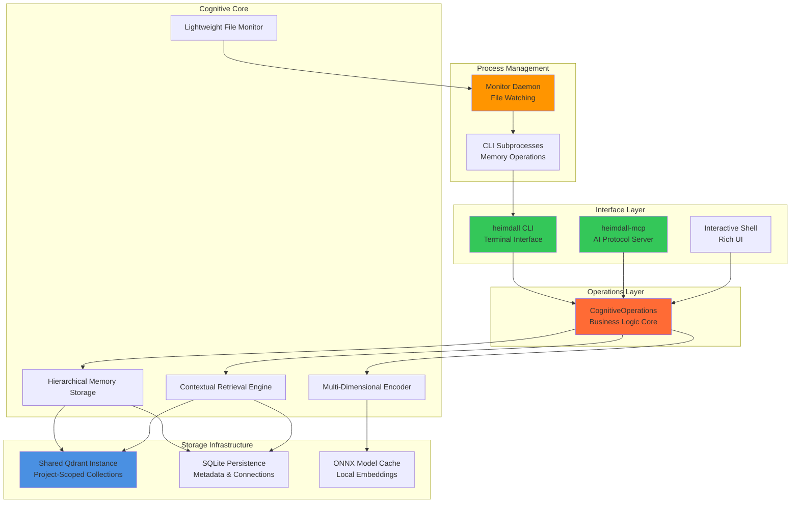
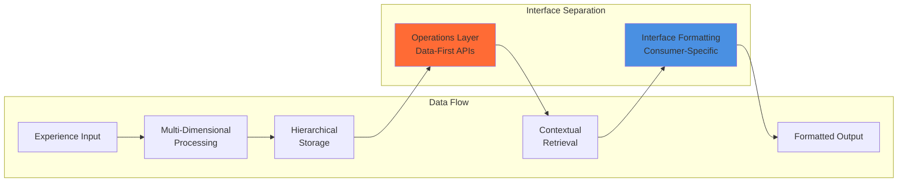

# Cognitive Memory System: Technical Architecture Specification

## Executive Overview

This document provides the technical architecture specification for the Heimdall cognitive memory system. The system implements true cognitive processing for Large Language Models using Python 3.13, enabling associative thinking, serendipitous connections, and emergent insights through multi-dimensional memory representation and dynamic activation patterns.

The architecture delivers a production-ready Python package distributed via pip, providing unified command-line interfaces and AI-agnostic MCP protocol support. The system uses a shared Qdrant vector database with project-scoped collections to enable efficient multi-project isolation while minimizing resource overhead. Core design principles emphasize operations-first architecture, clean interface separation, and subprocess delegation for optimal memory management.

## Technology Stack and Design Decisions

### Core Infrastructure Stack

| Component | Technology Choice | Rationale | Alternative Considered |
|-----------|------------------|-----------|----------------------|
| **Vector Database** | Qdrant | Production-ready, hierarchical collections, Python 3.13 compatible | Chroma, Weaviate, Custom NetworkX |
| **ML Framework** | ONNX Runtime + NumPy | Production deployment, 920MB smaller images, CPU-optimized | PyTorch, JAX, TensorFlow |
| **Base Embeddings** | ONNX all-MiniLM-L6-v2 | Fast local inference, ONNX-optimized, 384D vectors | Sentence-BERT, OpenAI embeddings, BGE-M3 |
| **Memory Persistence** | SQLite + JSON | Zero-setup, ACID transactions, flexible schema evolution | PostgreSQL, File-based |
| **Programming Language** | Python 3.13 | Latest features, async support, type hints | - |

### Cognitive Architecture Components

| Component | Implementation Approach | Technical Details |
|-----------|------------------------|------------------|
| **Dimension Extraction** | Rule-based + ML Hybrid | Regex patterns + sentiment analysis + learned classifiers |
| **Activation Algorithm** | Qdrant Collections + BFS | 3-collection hierarchy with breadth-first activation spreading |
| **Bridge Discovery** | Simple Distance Inversion | Inverse similarity scoring with connection potential weighting |
| **Memory Consolidation** | Time-based + Pattern-based | Episodic→Semantic promotion based on access frequency |

### Infrastructure Components

| Component | Technology Choice | Technical Details |
|-----------|------------------|------------------|
| **Configuration** | YAML + .env files | Project-local YAML config with environment variable fallbacks |
| **Logging** | Loguru | Structured logging for cognitive events and debugging |
| **API Interfaces** | Unified CLI + MCP Protocol | Dual entry points: `heimdall` terminal interface, `heimdall-mcp` AI-agnostic server |
| **Deployment** | Standard Python Package | pip installable with cross-platform compatibility |
| **Process Management** | Subprocess Delegation | Lightweight monitoring with CLI subprocess execution |

## System Architecture

### System Architecture Overview



### Interface Architecture Design



## Lightweight File Monitoring Architecture

The system implements a memory-efficient file monitoring architecture using subprocess delegation to eliminate memory leaks and optimize resource usage. The monitoring process remains lightweight by delegating cognitive operations to isolated CLI subprocesses.

### Architecture Components

#### Lightweight Monitor Process
- **LightweightMonitor**: Core monitoring daemon with minimal memory footprint (<50MB target)
- **MarkdownFileWatcher**: Polls `.heimdall/docs` directory for markdown file changes
- **EventQueue**: Thread-safe queue with event deduplication and batching
- **SingletonLock**: File-based process coordination preventing multiple monitor instances

#### Subprocess Delegation Pattern
- **CLI Subprocess Execution**: Heavy cognitive operations run as isolated `heimdall` command processes
- **Command Mapping**: File events map to specific CLI commands (`load`, `remove-file`)
- **Retry Logic**: Configurable retry attempts with exponential backoff for transient failures
- **Process Isolation**: Each cognitive operation runs independently and exits cleanly

#### Resource Management
- **Context Managers**: Guaranteed resource cleanup using Python context management
- **Signal Handling**: Graceful shutdown coordination via threading.Event
- **Lock Management**: Cross-platform file locking using portalocker library
- **PID Coordination**: Project-local PID files preventing conflicts

### CLI Integration

The monitoring service integrates with the unified CLI architecture:

```bash
# Monitoring lifecycle management
heimdall monitor start      # Start lightweight daemon process
heimdall monitor stop       # Stop monitoring service gracefully
heimdall monitor restart    # Restart with state preservation
heimdall monitor status     # Display daemon status and statistics
heimdall monitor health     # Comprehensive health validation

# Project initialization with monitoring
heimdall project init       # Automatically enables monitoring if configured
```

### Subprocess Command Delegation

File change events trigger specific CLI subprocess execution:

```bash
# File addition/modification
File Changed: docs/example.md → heimdall load docs/example.md

# File deletion
File Deleted: docs/example.md → heimdall remove-file docs/example.md
```

### Configuration Integration

Monitoring configuration through project-local YAML:

```yaml
# .heimdall/config.yaml
monitoring:
  enabled: true
  interval_seconds: 5.0
  target_path: ".heimdall/docs"

sync:
  enabled: true
  atomic_operations: true
```

### Memory Efficiency Design

The architecture prioritizes memory efficiency through several mechanisms:

- **Lazy Loading**: Cognitive system loaded only when processing files, not at daemon startup
- **Process Isolation**: Each file operation runs in separate subprocess with automatic cleanup
- **Minimal Dependencies**: Monitor process imports only essential modules for file watching
- **Resource Bounds**: Configurable limits on concurrent subprocess execution

### Data Flow Architecture

```
Daemon Process → File Watcher → Event Queue → Subprocess Coordinator → CLI Commands
     ↓               ↓              ↓              ↓                    ↓
Lightweight    File Changes   Event Batching   Command Mapping    Memory Operations
(<50MB)        Detection      & Deduplication   & Execution        (Isolated Process)
```

### Extensibility Framework

The monitoring system supports extension through modular components:

- **File Type Detection**: Configurable file extension monitoring patterns
- **Command Mapping**: Pluggable mapping from file events to CLI commands
- **Retry Strategies**: Configurable retry logic for different failure modes
- **Health Monitoring**: Extensible health check framework for service validation

## Technical Implementation Details

### Multi-Dimensional Encoding Implementation

#### Dimension Extraction Strategy
- **Emotional Dimensions**: VADER sentiment analysis + pattern recognition
- **Temporal Dimensions**: Regex patterns for urgency and deadline detection
- **Contextual Dimensions**: Rule-based classification of content types
- **Social Dimensions**: Interaction pattern detection

#### Base Embedding Integration
- **ONNX Model Loading**: Direct ONNX Runtime inference for all-MiniLM-L6-v2
- **Dimension Fusion**: NumPy-based concatenation of semantic + dimensional vectors
- **Vector Dimensions**: 384D semantic + 16D multi-dimensional = 400D final embeddings
- **Performance**: CPU-optimized inference, 2-3x faster than PyTorch equivalent

### Hierarchical Memory Storage with Qdrant

#### Collection Architecture
- **3-Tier Collections**: `cognitive_concepts` (L0), `cognitive_contexts` (L1), `cognitive_episodes` (L2)
- **Vector Configuration**: 400D embeddings with cosine distance
- **Optimization**: Memory-mapped storage for large datasets
- **Payload Storage**: Rich metadata including hierarchy level, importance scores, timestamps

#### Activation Spreading with BFS
- **Two-Phase Process**: Initial L0 concept activation, then BFS through connection graph
- **Configurable Thresholds**: Activation threshold (0.7) and maximum activations (50)
- **Connection Graph**: SQLite-based memory relationships with strength scoring
- **Result Classification**: Core memories (highest activation) vs peripheral memories

### Bridge Discovery Implementation

#### Distance Inversion Algorithm
- **Novelty Scoring**: Inverse similarity to query (1.0 - cosine_similarity)
- **Connection Potential**: Maximum similarity to any activated memory
- **Bridge Score**: Weighted combination (60% novelty + 40% connection potential)
- **Serendipitous Discovery**: Finds unexpected connections between distant concepts

### Memory Persistence with SQLite

#### Database Schema
```sql
-- Memory metadata and relationships
CREATE TABLE memories (
    id TEXT PRIMARY KEY,
    level INTEGER NOT NULL,  -- 0=concept, 1=context, 2=episode
    content TEXT NOT NULL,
    dimensions_json TEXT NOT NULL,  -- Multi-dimensional data
    qdrant_id TEXT NOT NULL,  -- Reference to Qdrant vector
    timestamp DATETIME NOT NULL,
    last_accessed DATETIME NOT NULL,
    access_count INTEGER DEFAULT 0,
    importance_score REAL DEFAULT 0.0,
    parent_id TEXT,  -- Hierarchical relationship
    memory_type TEXT DEFAULT 'episodic',  -- episodic/semantic
    decay_rate REAL DEFAULT 0.1,
    FOREIGN KEY (parent_id) REFERENCES memories(id)
);

-- Connection graph for activation spreading
CREATE TABLE memory_connections (
    source_id TEXT NOT NULL,
    target_id TEXT NOT NULL,
    connection_strength REAL NOT NULL,
    connection_type TEXT DEFAULT 'associative',
    created_at DATETIME NOT NULL,
    last_activated DATETIME,
    activation_count INTEGER DEFAULT 0,
    PRIMARY KEY (source_id, target_id),
    FOREIGN KEY (source_id) REFERENCES memories(id),
    FOREIGN KEY (target_id) REFERENCES memories(id)
);

-- Bridge discovery cache
CREATE TABLE bridge_cache (
    query_hash TEXT NOT NULL,
    bridge_memory_id TEXT NOT NULL,
    bridge_score REAL NOT NULL,
    novelty_score REAL NOT NULL,
    connection_potential REAL NOT NULL,
    created_at DATETIME NOT NULL,
    PRIMARY KEY (query_hash, bridge_memory_id),
    FOREIGN KEY (bridge_memory_id) REFERENCES memories(id)
);

-- Usage statistics for meta-learning
CREATE TABLE retrieval_stats (
    id INTEGER PRIMARY KEY AUTOINCREMENT,
    query_hash TEXT NOT NULL,
    memory_id TEXT NOT NULL,
    retrieval_type TEXT NOT NULL,  -- core/peripheral/bridge
    success_score REAL,
    timestamp DATETIME NOT NULL,
    FOREIGN KEY (memory_id) REFERENCES memories(id)
);

-- Indexes for performance
CREATE INDEX idx_memories_level ON memories(level);
CREATE INDEX idx_memories_timestamp ON memories(timestamp);
CREATE INDEX idx_memories_access_count ON memories(access_count);
CREATE INDEX idx_connections_strength ON memory_connections(connection_strength);
CREATE INDEX idx_bridge_cache_query ON bridge_cache(query_hash);
```

#### Dual Memory System Implementation
- **Episodic Storage**: Fast decay (0.1/day), temporary experiences, automatic cleanup
- **Semantic Storage**: Slow decay (0.01/day), consolidated patterns, long-term retention
- **Consolidation Process**: Promotes frequently accessed episodic memories to semantic
- **SQLite Integration**: Unified schema with memory_type field and decay_rate tracking

## Interface Design for Extensibility

All critical components are wrapped in abstract interfaces to enable easy swapping and scaling:

- **EmbeddingProvider**: Abstract interface supporting ONNX, PyTorch, or cloud providers
- **VectorStorage**: Qdrant, Chroma, or custom vector database backends
- **ActivationEngine**: Pluggable memory activation algorithms
- **BridgeDiscovery**: Swappable serendipity algorithms
- **MemoryLoader**: Content ingestion from markdown, PDFs, code repositories

## Implementation Phasing with Technical Details

### Phase 1: Foundation (Weeks 1-4)
**Technical Deliverables:**
- SQLite database schema and basic CRUD operations
- Sentence-BERT integration with dimension extraction
- Basic Qdrant collections setup
- Simple similarity-based retrieval
- Rule-based dimension extraction (emotional, temporal, contextual)

**Code Structure:**
```
cognitive_memory/
├── core/
│   ├── interfaces.py          # Abstract interfaces (EmbeddingProvider, etc.)
│   ├── memory.py             # CognitiveMemory, BridgeMemory data structures
│   ├── cognitive_system.py   # Main CognitiveSystem orchestrator
│   └── config.py             # System configuration
├── encoding/
│   ├── onnx_provider.py      # ONNX Runtime embedding provider
│   ├── dimensions.py         # Multi-dimensional feature extraction
│   └── cognitive_encoder.py  # Dimension fusion coordinator
├── storage/
│   ├── qdrant_storage.py     # Qdrant vector database operations
│   ├── sqlite_persistence.py # SQLite metadata storage
│   └── dual_memory.py        # Episodic/semantic memory system
├── retrieval/
│   ├── contextual_retrieval.py # Main retrieval coordinator
│   ├── basic_activation.py     # BFS activation spreading
│   └── bridge_discovery.py     # Serendipitous connections
├── git_analysis/
│   ├── commit.py             # Git commit data structures
│   ├── commit_loader.py      # Git history to memory conversion
│   └── history_miner.py      # Git repository analysis
├── loaders/
│   ├── git_loader.py         # Git repository integration
│   ├── markdown_loader.py    # Markdown processing coordinator
│   └── markdown/            # Specialized markdown components
│       ├── content_analyzer.py    # Linguistic analysis
│       ├── document_parser.py     # Markdown parsing
│       ├── memory_factory.py      # Memory creation
│       ├── connection_extractor.py # Relationship analysis
│       └── chunk_processor.py     # Document chunking
├── monitoring/              # Automatic file change monitoring
│   ├── file_monitor.py       # Polling-based file change detection
│   ├── file_sync.py         # Generic file synchronization handler
│   └── loader_registry.py   # MemoryLoader management and discovery
└── tests/
    ├── unit/                 # Component-level tests
    ├── integration/          # Cross-component tests
    └── e2e/                  # End-to-end scenarios

heimdall/
├── cli.py                      # Unified CLI entry point (heimdall command)
├── operations.py               # Pure operations layer - business logic
├── mcp_server.py              # Standalone MCP server (heimdall-mcp command)
├── interactive_shell.py       # Interactive memory shell
├── display_utils.py           # Rich terminal formatting utilities
├── cli_commands/              # Modular CLI command implementations
│   ├── cognitive_commands.py     # Memory operations (store, recall, load, status)
│   ├── health_commands.py        # Health checks and shell access
│   ├── qdrant_commands.py        # Qdrant service management
│   ├── monitor_commands.py       # File monitoring service
│   └── project_commands.py       # Project collection management
└── cognitive_system/          # Service management utilities
    ├── service_manager.py        # Docker/Qdrant service management
    ├── monitoring_service.py     # Automatic file monitoring service
    ├── health_checker.py         # System health validation
    └── service_health.py         # Health check system for monitoring

interfaces/
├── cli.py                     # Legacy CognitiveCLI (deprecated)
├── mcp_server.py             # Legacy MCP server (deprecated)
└── mcp_tools/                # Individual MCP tool implementations

scripts/
├── setup_project_memory.sh    # Project isolation setup
├── load_project_content.sh    # Content loading automation
└── claude_mcp_wrapper.sh      # Claude Code MCP integration
```

### Phase 2: Cognitive Enhancement (Weeks 5-8)
**Technical Deliverables:**
- Full multi-dimensional encoding with learned fusion
- Hierarchical memory organization (L0→L1→L2)
- BFS activation spreading through Qdrant collections
- Connection graph tracking in SQLite
- Simple distance inversion bridge discovery

### Phase 3: Emergent Intelligence (Weeks 9-12)
**Technical Deliverables:**
- Meta-learning controller for adaptive encoding
- Advanced bridge discovery with attention mechanisms
- Memory consolidation automation
- Performance optimization and scaling
- Comprehensive evaluation metrics

## Performance Considerations

### Computational Complexity
- **Memory Encoding**: O(1) per experience with Sentence-BERT
- **Hierarchical Search**: O(log n) through Qdrant collections
- **Activation Spreading**: O(k) where k = max_activations (bounded)
- **Bridge Discovery**: O(m) where m = candidate_memories (limited by sampling)

### Memory Requirements
- **Base Embeddings**: 384D float32 = 1.5KB per memory
- **Multi-dimensional Extensions**: +64 bytes per memory for dimensions
- **SQLite Metadata**: ~1KB per memory for full metadata
- **Qdrant Vectors**: Compressed storage with quantization options

### Scalability Targets
- **Phase 1**: 10K memories, single-user, local deployment
- **Phase 2**: 100K memories, multi-user, containerized deployment
- **Phase 3**: 1M+ memories, distributed deployment, horizontal scaling

## Quality Assurance and Testing

### Testing Strategy
1. **Unit Tests**: Each interface implementation tested independently
2. **Integration Tests**: End-to-end cognitive workflows
3. **Performance Tests**: Latency and throughput benchmarks
4. **Cognitive Tests**: Evaluation of bridge discovery quality
5. **Regression Tests**: Ensure upgrades maintain cognitive fidelity

### Evaluation Metrics
- **Retrieval Quality**: Precision@K, Recall@K for different memory types
- **Bridge Discovery**: Novelty score, connection relevance, user feedback
- **Consolidation Success**: Pattern extraction accuracy, compression ratios
- **System Performance**: Query latency, memory usage, throughput

## Development Environment and Code Quality

### Environment Setup
- **Python Environment**: `virtualenv` with Python 3.13
- **Dependency Management**: `pip-tools` with `requirements.in` → `requirements.txt`
- **Development Tools**: Separate `requirements-dev.txt` for linting/testing

### Code Quality Standards
- **Linting**: `ruff` (fast Python linter) + `mypy` (type checking) + `black` (formatting)
- **Code Smell Detection**: SonarQube integration for maintainability analysis
- **Import Organization**: `isort` for consistent import sorting

### Git Workflow and Quality Gates
**Pre-commit Requirements** (enforced on every commit):
- `ruff check` - Python linting and code style validation
- `ruff format` - Automatic code formatting
- `mypy` - Static type checking
- `pytest` - Run test suite
- Custom architecture validation - Ensure interface compliance

**Quality Thresholds**:
- Maximum cyclomatic complexity: 10
- Test coverage requirement: 85% for core cognitive components
- SonarQube maintainability rating: A
- Zero code smells in cognitive architecture components

## Configuration and Infrastructure

### Configuration Management
```bash
# .env file structure
QDRANT_URL=http://localhost:6333
QDRANT_API_KEY=optional_key
SQLITE_PATH=./data/cognitive_memory.db
SENTENCE_BERT_MODEL=all-MiniLM-L6-v2
LOG_LEVEL=INFO
ACTIVATION_THRESHOLD=0.7
BRIDGE_DISCOVERY_K=5
```

### Logging Strategy with Loguru
```python
# Cognitive event logging
logger.info("Memory formation", experience_id=uuid, dimensions=extracted_dims)
logger.debug("Activation spreading", activated_count=42, threshold=0.7)
logger.warning("Bridge discovery yielded no results", query_context=context_summary)
logger.error("Qdrant connection failed", error=str(e))
```

### Infrastructure Overview and User Interaction

```
┌─────────────────────────────────────────────────────────────────┐
│                    COGNITIVE MEMORY SYSTEM                      │
└─────────────────────────────────────────────────────────────────┘

┌─────────────────────────────────────────────────────────────────┐
│                      USER INTERFACES                           │
├─────────────────┬─────────────────┬─────────────────────────────┤
│   RESEARCHERS   │   WEB CLIENTS   │      AI SYSTEMS/LLMs        │
│                 │                 │                             │
│ $ memory_system │ HTTP Requests   │    MCP Protocol Client      │
│   shell         │ (REST API)      │    (Claude, GPT, etc.)      │
│                 │                 │                             │
│ Interactive     │ Web Dashboard   │ JSON-RPC over TCP/stdin     │
│ CLI Commands    │ API Integration │ Memory operations           │
└─────────────────┴─────────────────┴─────────────────────────────┘
         │                 │                        │
         ▼                 ▼                        ▼
┌─────────────────────────────────────────────────────────────────┐
│                    UNIFIED CLI LAYER                           │
│                    heimdall [command]                          │
├─────────────────────────────────────────────────────────────────┤
│ ┌─────────────┐ ┌─────────────┐ ┌─────────────┐ ┌─────────────┐ │
│ │   qdrant    │ │   project   │ │   monitor   │ │   doctor    │ │
│ │ start/stop  │ │ init/list   │ │ start/stop  │ │ health      │ │
│ │   status    │ │   clean     │ │   status    │ │ checks      │ │
│ │   logs      │ │             │ │             │ │             │ │
│ └─────────────┘ └─────────────┘ └─────────────┘ └─────────────┘ │
│ ┌─────────────┐ ┌─────────────┐ ┌─────────────┐ ┌─────────────┐ │
│ │    store    │ │   recall    │ │    load     │ │    shell    │ │
│ │ experience  │ │  memories   │ │   files     │ │ interactive │ │
│ │             │ │             │ │  git-load   │ │    REPL     │ │
│ │             │ │             │ │             │ │             │ │
│ └─────────────┘ └─────────────┘ └─────────────┘ └─────────────┘ │
└─────────────────────────────────────────────────────────────────┘
         │
         ▼
┌─────────────────────────────────────────────────────────────────┐
│                  COGNITIVE MEMORY CORE                         │
├─────────────────────────────────────────────────────────────────┤
│  Multi-dimensional Encoding → Storage → Retrieval → Insights   │
│                                                                 │
│  • Experience processing    • Memory formation                  │
│  • Context analysis        • Association building              │
│  • Bridge discovery        • Activation spreading              │
└─────────────────────────────────────────────────────────────────┘
         │
         ▼
┌─────────────────────────────────────────────────────────────────┐
│                    STORAGE LAYER                               │
├─────────────────┬───────────────────────────┬───────────────────┤
│   VECTOR DB     │      METADATA DB          │   MODEL CACHE     │
│                 │                           │                   │
│ ┌─────────────┐ │ ┌─────────────────────────┐ │ ┌─────────────┐ │
│ │   QDRANT    │ │ │        SQLITE           │ │ │    ONNX     │ │
│ │   SHARED    │ │ │                         │ │ │   MODELS    │ │
│ │ Project-    │ │ │ • Memory metadata       │ │ │             │ │
│ │ Scoped      │ │ │ • Connection graph      │ │ │ Embeddings  │ │
│ │ Collections │ │ │ • Usage statistics      │ │ │ Sentiment   │ │
│ │             │ │ │ • Bridge cache          │ │ │ Analysis    │ │
│ │ 400D        │ │ │                         │ │ │             │ │
│ │ Vectors     │ │ │ Relationships & Meta    │ │ │ Cached      │ │
│ └─────────────┘ │ └─────────────────────────┘ │ └─────────────┘ │
│                 │                           │                   │
│ Port: 6333      │ ~/.local/share/heimdall   │ Local Files     │
└─────────────────┴───────────────────────────┴───────────────────┘
```

### User Interaction Flows

#### 1. Researcher Workflow
```bash
# One-time setup
$ heimdall doctor              # Check system health
$ heimdall qdrant start       # Start vector database
$ heimdall shell               # Interactive session

# Daily usage
cognitive> store "Working on transformer attention mechanisms"
cognitive> recall "attention patterns"
cognitive> bridges "neural networks"
cognitive> exit
```

#### 2. LLM/AI System Integration (MCP)
```json
# LLM connects via MCP protocol
{
  "jsonrpc": "2.0",
  "method": "memory/store",
  "params": {
    "experience": "User struggling with Python async/await concepts",
    "context": "programming_help_session",
    "dimensions": {
      "emotional": "frustration",
      "temporal": "learning_phase",
      "contextual": "coding_tutorial"
    }
  }
}

# Response with memory formed
{
  "jsonrpc": "2.0",
  "result": {
    "memory_id": "mem_12345",
    "associations": ["async_programming", "python_concepts"],
    "bridges": ["javascript_promises", "concurrent_patterns"]
  }
}
```

#### 3. CLI Integration
```bash
# Direct CLI access
$ heimdall store "Important system insight"
$ heimdall recall "machine learning patterns"
```

### Setup Automation Infrastructure

#### Unified CLI Architecture
```python
# heimdall/cli.py
import typer
from typing import Optional

app = typer.Typer(help="Heimdall Cognitive Memory System")

# Import and register command modules
from heimdall.cli_commands import (
    cognitive_commands,
    health_commands,
    qdrant_commands,
    monitor_commands,
    project_commands
)

# Register cognitive operations
app.command("store")(cognitive_commands.store)
app.command("recall")(cognitive_commands.recall)
app.command("load")(cognitive_commands.load)
app.command("git-load")(cognitive_commands.git_load)
app.command("status")(cognitive_commands.status)

# Register health and shell commands
app.command("doctor")(health_commands.doctor)
app.command("shell")(health_commands.shell)

# Register service management commands
qdrant_app = typer.Typer(help="Qdrant vector database management")
app.add_typer(qdrant_app, name="qdrant")
qdrant_app.command("start")(qdrant_commands.qdrant_start)
qdrant_app.command("stop")(qdrant_commands.qdrant_stop)
qdrant_app.command("status")(qdrant_commands.qdrant_status)
qdrant_app.command("logs")(qdrant_commands.qdrant_logs)

# Register monitoring commands
monitor_app = typer.Typer(help="File monitoring service management")
app.add_typer(monitor_app, name="monitor")
monitor_app.command("start")(monitor_commands.monitor_start)
monitor_app.command("stop")(monitor_commands.monitor_stop)
monitor_app.command("restart")(monitor_commands.monitor_restart)
monitor_app.command("status")(monitor_commands.monitor_status)
monitor_app.command("health")(monitor_commands.monitor_health)

# Register project commands
project_app = typer.Typer(help="Project memory management")
app.add_typer(project_app, name="project")
project_app.command("init")(project_commands.project_init)
project_app.command("list")(project_commands.project_list)
project_app.command("clean")(project_commands.project_clean)
```

#### Service Management Flow
```
Experience Input → Multi-dimensional Encoding → Vector Storage (Qdrant)
                                              → Metadata Storage (SQLite)
                                              → Connection Graph Updates
                                              → Available for Retrieval
```

#### How Components Work Together
1. **Setup Phase**: System creates shared data directories, initializes project-scoped collections, starts shared Qdrant service as needed
2. **Runtime Architecture**: Dual entry points - `heimdall` command for terminal use, `heimdall-mcp` for AI integration
3. **Persistent Storage**: Memories survive restarts via shared Qdrant instance and local metadata files
4. **AI System Integration**: LLMs connect via standalone MCP server for real-time memory operations, context preservation, serendipitous discovery
5. **Process Management**: Lightweight monitoring delegates to CLI subprocesses for memory operations

**API Operations**:
- `store_experience(text, context)` - Form new memory
- `retrieve_memories(query, types=['core', 'peripheral', 'bridge'])` - Cognitive retrieval
- `get_memory_stats()` - System state and metrics
- `consolidate_memories()` - Trigger episodic→semantic consolidation

**Project Structure**:
```
cognitive-memory/
├── .env                      # Environment configuration
├── .pre-commit-config.yaml   # Git hook configuration
├── pyproject.toml           # Python project settings
├── CLAUDE.md               # Project instructions for AI assistants
├── cognitive_memory/        # Core cognitive system
│   ├── core/               # System interfaces and orchestration
│   ├── encoding/           # ONNX-based embedding and dimension extraction
│   ├── storage/            # Qdrant + SQLite persistence layer
│   ├── retrieval/          # Memory activation and bridge discovery
│   ├── git_analysis/       # Git commit processing and analysis
│   ├── loaders/            # Content ingestion (markdown, git)
│   └── monitoring/         # File change detection
├── heimdall/               # Unified CLI and MCP interfaces
│   ├── cli.py             # Main heimdall command entry point
│   ├── operations.py      # Pure operations layer (business logic)
│   ├── mcp_server.py      # Standalone MCP server (heimdall-mcp)
│   ├── interactive_shell.py # Interactive memory operations
│   ├── display_utils.py   # Rich terminal formatting utilities
│   ├── cli_commands/      # Modular CLI command implementations
│   ├── cognitive_system/  # Service management utilities
│   └── monitoring/        # Lightweight file monitoring
├── docker/                 # Container infrastructure
│   └── docker-compose.template.yml # Shared Qdrant service
├── scripts/               # Automation and setup utilities
│   ├── setup_claude_code_mcp.sh   # Claude Code integration
│   ├── post_commit_hook.py        # Git hook integration
│   └── git_hook_installer.py      # Git hook management
├── docs/                  # Architecture and usage documentation
│   ├── arch-docs/         # Technical architecture specifications
│   ├── progress/          # Development progress tracking
│   └── monitoring-architecture.md # File monitoring details
└── tests/                 # Comprehensive test suite
    ├── unit/              # Component-level tests
    ├── integration/       # Cross-component integration tests
    └── e2e/               # End-to-end system tests
```

## Conclusion

This technical specification provides the architectural foundation for the Heimdall cognitive memory system, balancing advanced cognitive capabilities with practical engineering constraints. The operations-first architecture enables clean separation of concerns, making the system maintainable and extensible for future interface additions.

The chosen technology stack (Shared Qdrant + ONNX Runtime + NumPy + SQLite) provides optimal cognitive fidelity, deployment efficiency, and operational simplicity. The unified CLI architecture with subprocess delegation ensures memory efficiency while maintaining comprehensive functionality.

## Detailed Implementation Documentation

For specific implementation details and development progress, refer to the following specialized documents:

### Architecture Details
- **Unified CLI Architecture**: `docs/arch-docs/unified-cli-architecture.md` - Operations layer design and interface separation
- **File Monitoring Architecture**: `docs/monitoring-architecture.md` - Lightweight subprocess delegation patterns

### Implementation Progress
- **Shared Qdrant Migration**: `docs/progress/021_shared_qdrant_architecture.md` - Project isolation via collections
- **CLI Consolidation**: `docs/progress/022_unified_cli_architecture.md` - Operations-first design implementation
- **Lightweight Monitoring**: `docs/progress/023_lightweight_monitoring_architecture.md` - Memory-efficient file monitoring

These documents provide comprehensive technical details, implementation decisions, and development milestones for each architectural component.
