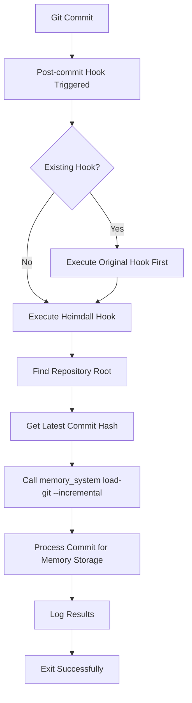

# Git Hook Setup for Incremental Loading

Heimdall MCP Server can automatically process new git commits using post-commit hooks, enabling real-time memory creation as you develop.

## Overview

The git hook integration provides:
- **Automatic Processing**: New commits are processed immediately after creation
- **Incremental Loading**: Only new commits are processed, not the entire history
- **Safe Installation**: Existing hooks are preserved and chained
- **Graceful Failure**: Hook failures don't break git operations
- **Easy Management**: Simple installation, status checking, and removal

## Quick Start

### 1. Setup Project Memory Containers (Recommended)

```bash
# Navigate to your git repository
cd /path/to/your/project

# Setup project-specific memory containers
/path/to/heimdall-mcp-server/scripts/setup_project_memory.sh

# This creates isolated Docker containers for this project
```

### 2. Install Hook in Current Repository

```bash
# Install the hook (will use project containers automatically)
/path/to/heimdall-mcp-server/scripts/git-hook-installer.sh --install
```

### 3. Check Installation Status

```bash
# Check if hook is installed and working
/path/to/heimdall-mcp-server/scripts/git-hook-installer.sh --status
```

### 4. Test the Hook

```bash
# Make a test commit to verify hook execution
echo "Test change" >> README.md
git add README.md
git commit -m "Test commit for Heimdall hook"

# Check hook logs
tail -f ~/.heimdall/hook.log
```

## Installation Options

### Basic Installation

```bash
# Install in current directory
./scripts/git-hook-installer.sh

# Install in specific repository
./scripts/git-hook-installer.sh /path/to/repo
```

### Advanced Installation

```bash
# Preview what would be installed (dry run)
./scripts/git-hook-installer.sh --dry-run

# Force installation even if other hooks exist
./scripts/git-hook-installer.sh --force

# Install with chaining of existing hooks
./scripts/git-hook-installer.sh --force /path/to/repo
```

### Status and Management

```bash
# Check current status
./scripts/git-hook-installer.sh --status

# Uninstall hook
./scripts/git-hook-installer.sh --uninstall

# Uninstall with preview
./scripts/git-hook-installer.sh --uninstall --dry-run
```

## How It Works

### Hook Execution Flow



### Memory System Integration

The hook automatically detects and uses the appropriate memory system:

#### Project Container Integration (Preferred)
When project-specific Docker containers are available:
```bash
# Hook detects project container: heimdall-{repo-name}-{project-hash}
docker exec -w /repo/path heimdall-myproject-a1b2c3d4 python -m memory_system.cli load-git incremental --max-commits=1
```

#### Fallback Methods
When containers aren't available, the hook falls back to:
1. System-installed `memory_system` command
2. Local Python CLI from Heimdall installation

#### Processing Flow
For each new commit, the hook:
1. Detects project-specific container using path hash
2. Executes incremental git loading in proper context
3. Converts the commit to a cognitive memory
4. Stores it in the project's isolated memory collection
5. Updates incremental state for future runs

### Error Handling

The hook is designed to be robust:
- **Never breaks git operations**: Always exits with code 0
- **Graceful degradation**: Continues if memory system unavailable
- **Comprehensive logging**: All errors logged to `~/.heimdall/hook.log`
- **Timeout protection**: 5-minute timeout prevents hanging
- **Resource detection**: Auto-detects memory_system installation

## Hook Safety Features

### Existing Hook Preservation

The installer safely handles existing post-commit hooks:

#### Scenario 1: No Existing Hook
- Creates direct symlink to Heimdall hook script
- Simple and efficient execution

#### Scenario 2: Existing Hook Present
- Backs up original hook to `.git/hooks/post-commit.heimdall-backup`
- Creates chained hook that executes both:
  1. Original hook (with error handling)
  2. Heimdall hook (always executes)
- Preserves all existing functionality

#### Scenario 3: Heimdall Already Installed
- Detects existing installation
- Prevents duplicate installation
- Allows forced reinstallation with `--force`

### Uninstallation Safety

```bash
# Safe removal with original hook restoration
./scripts/git-hook-installer.sh --uninstall
```

The uninstaller:
- Removes Heimdall hook cleanly
- Restores original hook from backup (if exists)
- Preserves repository git functionality
- Provides dry-run preview option

## CLI Commands

### Manual Incremental Loading

You can manually trigger incremental loading without hooks:

```bash
# Load incremental commits from current directory
memory_system load-git incremental

# Load from specific repository
memory_system load-git incremental /path/to/repo

# Load only latest commit
memory_system load-git incremental --max-commits=1

# Force full reload (ignore incremental state)
memory_system load-git incremental --force-full

# Preview what would be loaded
memory_system load-git incremental --dry-run
```

### Service Management

```bash
# Check memory system health
memory_system doctor

# Start required services
memory_system qdrant start

# Check service status
memory_system qdrant status
```

## Configuration

### Hook Logging

Hook execution logs are written to `~/.heimdall/hook.log`:

```bash
# View recent hook activity
tail -20 ~/.heimdall/hook.log

# Follow real-time logs
tail -f ~/.heimdall/hook.log

# Search for errors
grep "ERROR" ~/.heimdall/hook.log
```

### Log Rotation

- Logs are automatically rotated when they exceed 1MB
- Old logs are saved as `.heimdall/hook.log.old`
- Manual cleanup can be done by removing log files

### Environment Variables

The hook respects standard Heimdall environment variables:

```bash
# Custom Qdrant URL
export QDRANT_URL=http://localhost:6333

# Custom database path
export COGNITIVE_MEMORY_DB_PATH=./data/cognitive_memory.db

# Custom model
export SENTENCE_BERT_MODEL=all-MiniLM-L6-v2
```

## Troubleshooting

### Common Issues

#### Hook Not Executing

```bash
# Check hook status
./scripts/git-hook-installer.sh --status

# Verify hook file exists and is executable
ls -la .git/hooks/post-commit

# Check recent hook logs
tail -20 ~/.heimdall/hook.log
```

#### Memory System Not Found

```bash
# Verify memory_system is in PATH
which memory_system

# Or check if Heimdall is properly installed
ls -la /path/to/heimdall-mcp-server/memory_system/cli.py
```

#### Hook Execution Failures

```bash
# Check detailed error logs
grep "ERROR\|WARN" ~/.heimdall/hook.log

# Test manual incremental loading
memory_system load-git incremental --dry-run

# Verify services are running
memory_system doctor
```

### Debug Mode

For debugging hook issues:

```bash
# Run hook manually with full output
cd /path/to/repo
/path/to/heimdall-mcp-server/scripts/post-commit-hook.sh

# Enable bash debugging in hook script
# Edit the hook script and add: set -x
```

### Recovery

If hooks cause issues:

```bash
# Remove hook entirely
./scripts/git-hook-installer.sh --uninstall

# Check git operations work normally
git status
git log --oneline -5

# Reinstall with fresh configuration
./scripts/git-hook-installer.sh --force
```

## Performance Considerations

### Hook Execution Time

- Typical execution: 1-5 seconds per commit
- Processing time scales with commit size
- Network latency affects Qdrant operations
- Timeout prevents indefinite hanging (5 minutes)

### Resource Usage

- Minimal CPU impact (mostly I/O bound)
- Memory usage depends on commit content size
- Qdrant storage grows incrementally
- SQLite operations are lightweight

### Optimization Tips

```bash
# Use local Qdrant for better performance
memory_system qdrant start --force-local

# Monitor resource usage during commits
htop  # or similar system monitor

# Check Qdrant collection sizes
memory_system doctor --verbose
```

## Integration Examples

### CI/CD Integration

```yaml
# .github/workflows/memory-update.yml
- name: Update project memory
  run: |
    memory_system qdrant start --wait-timeout=60
    memory_system load-git incremental --max-commits=10
```

### Development Workflow

```bash
# Setup new project with memory tracking
git clone https://github.com/user/project.git
cd project
/path/to/heimdall-mcp-server/scripts/git-hook-installer.sh --install

# Development with automatic memory updates
git checkout -b feature-branch
# ... make changes ...
git commit -m "Implement new feature"  # Hook automatically processes
```

### Multi-Repository Management

```bash
# Install hooks across multiple projects
for repo in ~/projects/*/; do
    if [[ -d "$repo/.git" ]]; then
        echo "Installing hook in $repo"
        /path/to/heimdall-mcp-server/scripts/git-hook-installer.sh "$repo"
    fi
done
```

## Security Considerations

### Hook Script Safety

- Hook script validates git repository state
- No arbitrary code execution from git data
- Proper error handling prevents information leakage
- Logs don't contain sensitive repository content

### Access Control

- Hook respects git repository permissions
- Memory system uses standard authentication
- No additional privileges required
- Runs with user's existing permissions

### Data Privacy

- Only commit metadata and structure stored
- File content is processed but not stored verbatim
- Semantic embeddings don't reveal exact code
- Local storage maintains data privacy