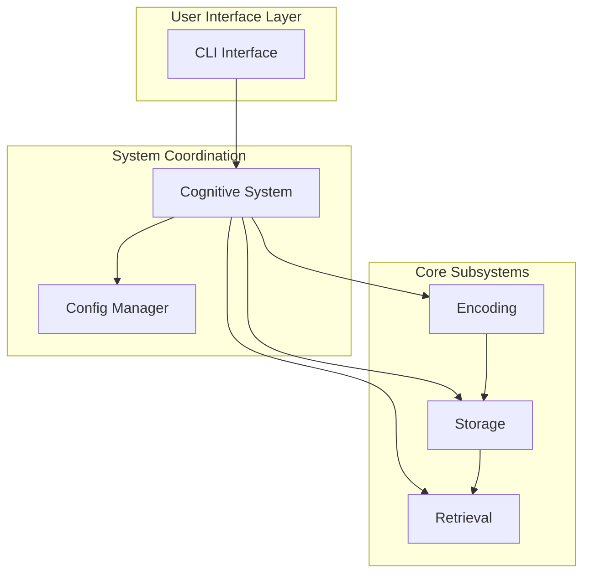

# 004 - Phase 1: API and CLI Interfaces

## Overview
Phase 1 Step 004 implements the user-facing interfaces for the cognitive memory system. This phase creates a simple stdio CLI interface and basic configuration management, providing end-users with access to the core cognitive memory capabilities through command-line interaction while laying the groundwork for future API development.

## Status
- **Started**: 2025-06-17
- **Current Phase**: Implementation Complete
- **Completion**: 100%
- **Expected Completion**: 2025-06-17

## Objectives
- [x] Implement basic stdio CLI for cognitive memory operations
- [x] Create configuration management system with .env support
- [x] Develop core interface definitions for all system components
- [x] Build basic cognitive system coordinator/facade
- [x] Enable end-to-end user interaction with memory formation and retrieval
- [x] Comprehensive testing of user-facing interfaces

## Implementation Progress

### Step 4A: Core Interface Definitions
**Status**: Completed
**Priority**: High
**Date Range**: 2025-06-17

#### Tasks Completed
- [x] Core interfaces already existed in `core/interfaces.py` with comprehensive definitions
- [x] All required interfaces defined: `EmbeddingProvider`, `VectorStorage`, `ActivationEngine`, `BridgeDiscovery`, `MemoryStorage`, `CognitiveSystem`, `ConnectionGraph`, `DimensionExtractor`
- [x] Interface compliance validated through abstract base classes
- [x] Comprehensive interface documentation with proper type annotations

### Step 4B: Configuration Management
**Status**: Completed
**Priority**: High
**Date Range**: 2025-06-17

#### Tasks Completed
- [x] Advanced configuration system already implemented in `core/config.py`
- [x] Full .env file support with python-dotenv integration
- [x] Comprehensive configuration validation with dataclass structure
- [x] Environment-specific configuration loading through `SystemConfig.from_env()`
- [x] Hierarchical configuration with QdrantConfig, DatabaseConfig, EmbeddingConfig, CognitiveConfig, LoggingConfig
- [x] Configuration validation with error reporting and directory creation

### Step 4C: Cognitive System Coordinator
**Status**: Completed
**Priority**: High
**Date Range**: 2025-06-17

#### Tasks Completed
- [x] Created `CognitiveMemorySystem` implementing the `CognitiveSystem` interface in `core/cognitive_system.py`
- [x] Full dependency injection for all subsystems through abstract interfaces
- [x] Implemented high-level operations: `store_experience()`, `retrieve_memories()`, `consolidate_memories()`, `get_memory_stats()`
- [x] Proper system coordination with encoding, vector storage, memory storage, activation engine, and bridge discovery
- [x] Comprehensive error handling with graceful degradation and detailed logging
- [x] Memory consolidation logic from episodic to semantic memory
- [x] Multi-type memory retrieval (core, peripheral, bridge) with configurable limits

### Step 4D: Simple CLI Interface
**Status**: Completed
**Priority**: Medium
**Date Range**: 2025-06-17

#### Tasks Completed
- [x] Created comprehensive CLI interface in `interfaces/cli.py`
- [x] Implemented all core commands: store, retrieve, status, consolidate, clear (placeholder)
- [x] Full interactive mode with command prompt and help system
- [x] Batch mode support through argparse with subcommands
- [x] Comprehensive help system and command documentation
- [x] Error handling and user-friendly output formatting
- [x] Support for memory type filtering (core, peripheral, bridge)
- [x] Detailed status reporting with configuration display

## Technical Architecture

### Interface Component Structure
```
cognitive_memory/
├── core/
│   ├── interfaces.py        # Abstract base classes for all components
│   ├── config.py           # Configuration management
│   └── cognitive_system.py # High-level system coordinator
└── interfaces/
    └── cli.py              # Simple stdio command-line interface
```

### Core Abstract Interfaces
```python
# Key interfaces to be defined
class EmbeddingProvider(ABC):
    @abstractmethod
    def encode(self, text: str) -> torch.Tensor: ...

class VectorStorage(ABC):
    @abstractmethod
    def store_vector(self, id: str, vector: torch.Tensor, metadata: dict): ...

class ActivationEngine(ABC):
    @abstractmethod
    def activate_memories(self, context: torch.Tensor, threshold: float): ...

class CognitiveSystem(ABC):
    @abstractmethod
    def store_experience(self, text: str, context: dict = None): ...
    @abstractmethod
    def retrieve_memories(self, query: str, types: List[str] = None): ...
```

### CLI Command Structure
```bash
# Basic CLI operations
cognitive-cli store "Had trouble debugging the authentication flow"
cognitive-cli retrieve "authentication issues"
cognitive-cli status
cognitive-cli clear --confirm

# Interactive mode
cognitive-cli interactive
> store "Working on performance optimization"
> retrieve "optimization"
> help
> quit
```

### Configuration Schema
```python
# .env configuration options
QDRANT_URL=http://localhost:6333
QDRANT_API_KEY=optional_key
SQLITE_PATH=./data/cognitive_memory.db
SENTENCE_BERT_MODEL=all-MiniLM-L6-v2
LOG_LEVEL=INFO
ACTIVATION_THRESHOLD=0.7
BRIDGE_DISCOVERY_K=5
MAX_MEMORIES_PER_QUERY=50
MEMORY_DECAY_RATE=0.1
```

### System Integration Flow


### Key Design Decisions
- **Simple stdio CLI**: Focus on functionality over sophisticated UI for Phase 1
- **Facade pattern**: CognitiveSystem provides simple interface to complex subsystems
- **Interface-first design**: All components implement well-defined abstract interfaces
- **Configuration externalization**: All parameters configurable via environment
- **Graceful degradation**: System continues operation with reduced functionality on errors

## CLI Command Specifications

### Core Commands
```bash
# Memory formation
cognitive-cli store <text> [--context <json>] [--level <0|1|2>]

# Memory retrieval
cognitive-cli retrieve <query> [--types core,peripheral,bridge] [--limit <n>]

# System status
cognitive-cli status [--detailed] [--stats]

# Memory management
cognitive-cli clear [--confirm] [--type episodic|semantic|all]
cognitive-cli consolidate [--dry-run] [--threshold <float>]

# Interactive mode
cognitive-cli interactive [--prompt <string>]
```

### Interactive Mode Commands
```
> store <text>           # Store new experience
> retrieve <query>       # Retrieve memories
> bridges <query>        # Show bridge connections
> status                 # System status
> config                 # Show configuration
> help [command]         # Command help
> quit                   # Exit interactive mode
```

## Dependencies
- python-dotenv (environment configuration)
- argparse (CLI argument parsing)
- rich or colorama (CLI formatting, optional)
- typing (interface definitions)
- abc (abstract base classes)
- All core cognitive system components

## Integration Points
- **With All Subsystems**: Interfaces define contracts for encoding, storage, retrieval
- **With Configuration**: All components receive configuration through ConfigManager
- **With Testing**: Interface compliance enables comprehensive mocking and testing
- **Future APIs**: CLI patterns inform MCP server development

## Testing Strategy
- Interface compliance testing for all implementations
- CLI command testing with input/output validation
- Configuration loading and validation testing
- End-to-end workflow testing through CLI
- Error handling and edge case testing
- Mock implementation testing for development

## Success Criteria
- [x] All core interfaces defined and documented
- [x] Configuration system operational with .env support
- [x] CognitiveSystem facade integrates all subsystems successfully
- [x] CLI provides full access to cognitive memory operations
- [x] Interactive mode functional and user-friendly
- [x] All components implement required interfaces
- [x] Comprehensive test coverage for interface layer (13 tests passing)
- [x] All quality gates pass (ruff, mypy, pytest)

## User Experience Goals
- **Simplicity**: Basic operations should be intuitive and straightforward
- **Discoverability**: Help system guides users through available functionality
- **Feedback**: Clear success/error messages for all operations
- **Performance**: Fast response times for common operations
- **Reliability**: Graceful handling of errors and edge cases

## Risks & Mitigation
- **Risk**: Interface complexity may be overwhelming for Phase 1
  - **Mitigation**: Start with minimal viable interfaces, expand incrementally
- **Risk**: CLI may be too basic for effective user testing
  - **Mitigation**: Focus on core functionality, plan UI enhancements for Phase 2
- **Risk**: Configuration management complexity
  - **Mitigation**: Use proven patterns, comprehensive validation

## Future Enhancements (Phase 2+)
- MCP protocol server for Claude integration (completed)
- Web-based user interface
- Advanced CLI features (history, autocompletion, colors)
- Configuration UI and management tools

## Resources
- Technical specification: `architecture-technical-specification.md`
- Previous phases: `001_phase1_foundation.md`, `002_phase1_storage.md`, `003_phase1_retrieval.md`
- Python argparse documentation
- Python-dotenv configuration management
- Abstract base class patterns in Python

## Change Log
- **2025-06-17**: Step 004 progress document created
- **2025-06-17**: Interface and CLI scope defined
- **2025-06-17**: Architecture and command specifications planned
